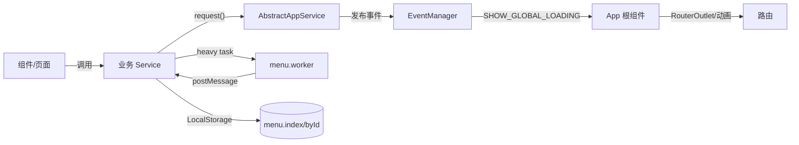
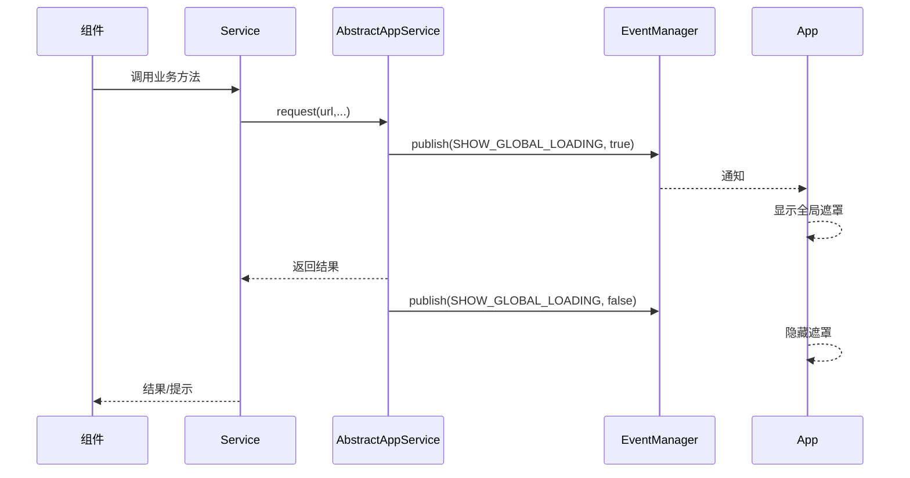
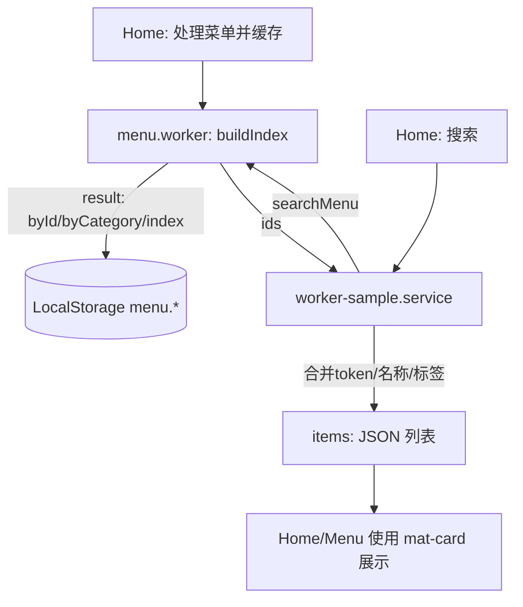

# CrossPlatformApp（跨平台应用骨架）

本项目基于 Angular 20 + Angular Material + Capacitor 7，提供 Android 大屏（收银/点餐）应用的跨端骨架，内置扫码、全局加载遮罩、Web Worker 菜单索引、环境切换、动画与统一 UI 规范。

## 1. 基础环境

- Node ≥ 20（推荐 22）
- npm ≥ 10
- Angular CLI 20.3.x
- Android（可选）：Android Studio / SDK（用于运行 Capacitor Android 项目）

快速检查：
```bash
node -v && npm -v && ng version
```

## 2. 快速开始

安装依赖与启动：
```bash
npm i
npm run start:dev      # http://localhost:8888
```

构建与同步到 Android：
```bash
npm run build:dev      # ng build -c development
npm run sync           # npx cap sync（已配置 webDir）
```

其它环境：
```bash
ng build -c mock       # 使用 mock 配置
ng build -c production # 生产配置
```

> 已在 `angular.json` 中配置 dev/mock/production 的 fileReplacements 与默认 development 运行。

## 3. 目录结构（关键）

```
src/
  app/
    features/
      home/            # 首页 - 例子（处理/搜索菜单演示）
      menu/            # 菜单页 - 例子（展示本地缓存的全量菜单）
    services/
      barcode.service.ts       # 扫码服务（MLKit 插件）
      worker-sample.service.ts # Worker 封装：菜单索引与搜索
    app.config.ts      # 应用 providers（HttpClient、i18n、等）
    app.routes.ts      # 路由与动画标识 data.animation
    app.ts / app.html  # 根组件（工具栏、遮罩、动画绑定）
    animations.ts      # 路由切换动画（大屏侧滑）
    app.event.ts       # 全局事件（SHOW_GLOBAL_LOADING）
  commons/
    component/abstract.app.component.ts  # 提示实现（MatSnackBar/Dialog）
    component/abstract.app.service.ts    # 重写 request，加遮罩事件
  workers/
    menu.worker.ts     # 菜单索引与搜索（Web Worker）
  styles.scss          # 全局样式（统一卡片 .app-card 等）
```

### 架构总览（Mermaid）



## 4. 运行机制

- 全局加载遮罩：`AbstractAppService.request()` 在发起/结束时，通过 `EventManager` 发布 `AppEvent.SHOW_GLOBAL_LOADING`，根组件订阅后用 `MatProgressSpinner` 展示半透明遮罩。
- Web Worker：`workers/menu.worker.ts` 负责构建菜单索引（byId/byCategory/index），`worker-sample.service.ts` 封装调用，支持名称、标签与 token 包含匹配，并最终返回菜品 JSON。
- 动画：`animations.ts` 采用大屏友好的“侧滑+轻缩放”，通过 `data.animation` 与 `[@routeAnimations]` 绑定实现页面切换。
- UI 统一：`styles.scss` 定义 `.app-card` 统一卡片高度/背景/描边，可跨页面使用；输入与按钮在首页以类 `.match-height` 对齐。
- 国际化：已集成 `@ngx-translate/core@17`，在 `app.config.ts` 通过 `TranslateModule.forRoot({ loader })` 注册自定义 `TranslateLoader`（HTTP 加载），默认语言 `zh-CN`。

### 请求/遮罩时序


### Worker/菜单索引


## 5. 使用方法

首页（Home）：
- “拉取最新菜单”示例：本地生成模拟菜单并通过 Worker 构建索引，缓存至 `LocalStorage`（`menu.byId/index/byCategory`）。
- 搜索：输入关键字（回车或点“搜索菜品”），展示命中的菜品卡片。

菜单页（Menu）：
- 读取 `LocalStorage` 的 `menu.byId`，以 `mat-card` 栅格展示全量菜单。

扫码：
- `BarcodeService` 封装了 `@capacitor-mlkit/barcode-scanning` 插件，根组件按钮 `开始扫码` 可直接调用。

## 6. 环境与配置

- `angular.json` 已配置：
  - `defaultConfiguration: development`
  - `dev/mock/production` 的 `fileReplacements`
- 国际化资源路径可在 `environment.i18nPathKey` 配置（默认 `/assets/i18n/`）。
- Capacitor `webDir` 指向 `dist/cross-platform-app/browser`，构建后 `npx cap copy android` 自动同步资源。

## 7. 编码规范（关键摘录）

- 命名：
  - 变量/函数用完整可读的单词，不用缩写；函数用动词短语，变量用名词短语。
  - 例如：`onMenuProcess`、`searchItems`、`getRouteAnimationData`。
- 组件职责：
  - 仅负责视图与用户交互（信号、绑定、事件转发），业务/网络请求放 `service`。
- 控制流：
  - 优先早返回；错误优先处理；避免深层嵌套。
- 注释：
  - 解释“为什么”，非“如何”；避免无意义注释；复杂块前置注释。
- 样式：
  - 统一使用全局类（如 `.app-card`、`.toolbar-spacer`）和组件局部样式；避免内联样式。
- 模板：
  - 使用内置控制流（`@if/@for`），少用旧的 `*ngIf/*ngFor`。

## 8. 基于现有架构新增功能（最佳实践）

以新增“订单（orders）”为例：

1) 生成页面（Standalone）
```bash
ng g c features/orders/pages/order-list --standalone --style=scss --skip-tests
```

2) 路由接入
```ts
// app.routes.ts
{ path: 'orders', loadComponent: () => import('./features/orders/pages/order-list/order-list').then(m => m.OrderList), data: { animation: 'orders' } }
```

3) Service 编排
```ts
@Injectable({ providedIn: 'root' })
export class OrderService extends AbstractAppService {
  list(params: PageQuery) { return this.request<Page<Order>>(ApiUrl.ORDER_PAGE, params); }
}
```

4) 事件与遮罩
- 直接调用 `this.request` 已集成全局遮罩；如需额外 UI 提示，继承 `AbstractAppComponent` 使用 `info/success/error/confirm`。

5) Web Worker（可选）
- 若有大计算（如订单统计、离线聚合），按 `workers/menu.worker.ts` 模板新增 `orders.worker.ts`，在 Service 封装调用。

6) UI
- 统一使用 `.app-card` 与 Material 组件；避免内联样式；必要时在 `styles.scss` 增加全局原子类。

## 9. 常用脚本

```bash
npm run start:dev   # 开发
npm run build:dev   # 构建开发包
npm run build:prod  # 构建生产包
npm run sync        # 同步 Capacitor 平台
npm run watch       # watch 构建
```

## 10. 重要约定

- 本地菜单缓存键：`menu.byId`, `menu.index`, `menu.byCategory`（命名空间：`menu`）。
- 路由动画标识：在 `app.routes.ts` 的每个条目中设置 `data: { animation: 'xxx' }`。
- 全局卡片：所有展示型卡片统一使用类 `.app-card` 保持一致宽高与背景。

---

如需接入条码支付、会员/优惠引擎、打印与外设驱动，可在 `features/` 下以功能域拆分模块，按本文规范接入 Service/Worker/路由与事件，保证一致性与可维护性。
