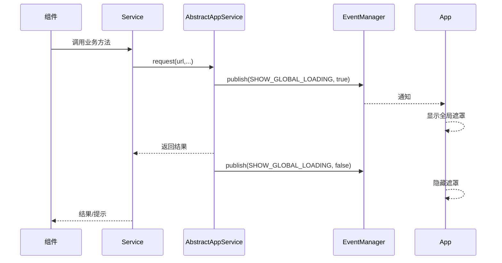
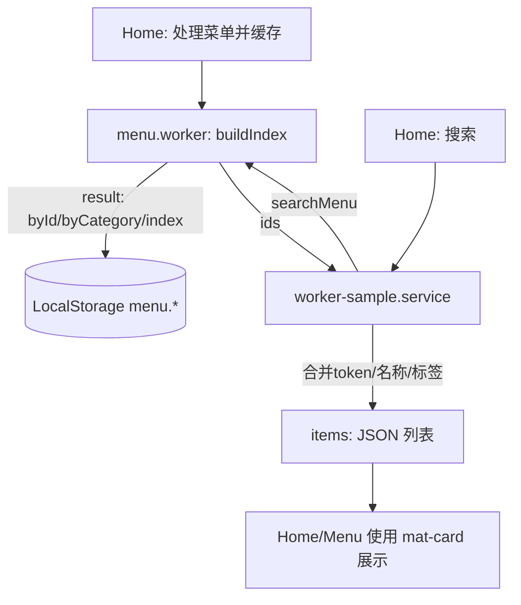

# CrossPlatformApp（跨平台应用骨架）

本项目基于 Angular 20 + Angular Material + Capacitor 7，提供 Android 大屏（收银/点餐）应用的跨端骨架，内置扫码、全局加载遮罩、Web Worker 菜单索引、环境切换、动画与统一 UI 规范。

## 1. 基础环境

- Node ≥ 20（推荐 22）
- npm ≥ 10
- Angular CLI 20.3.x
- Android（可选）：Android Studio / SDK（用于运行 Capacitor Android 项目）

快速检查：
```bash
node -v && npm -v && ng version
```

## 2. 快速开始

安装依赖与启动：
```bash
npm i
npm run start:dev      # http://localhost:8888
```

构建与同步到 Android：
```bash
npm run build:dev      # ng build -c development
npm run sync           # npx cap sync（已配置 webDir）
```

其它环境：
```bash
ng build -c mock       # 使用 mock 配置
ng build -c production # 生产配置
```

> 已在 `angular.json` 中配置 dev/mock/production 的 fileReplacements 与默认 development 运行。

## 3. 目录结构与开发约定

本项目的源代码遵循 Angular 社区推崇的**模块化、关注点分离**的最佳实践。核心思想是按功能（Features）组织代码，并明确区分应用核心（Core）、跨功能共享（Shared）的逻辑。

### 3.1. 源代码结构树 (`src/`)

```
src/
├── app/
│   ├── core/                  # 核心模块 (仅导入一次)
│   │   ├── animations/
│   │   │   └── route-animations.ts # 全局路由切换动画
│   │   ├── constants/
│   │   │   ├── app.event.ts      # 全局事件常量枚举
│   │   │   └── app.url.ts        # 全局路由/API地址枚举
│   │   └── services/
│   │       └── barcode.service.ts  # 单例服务 (如扫码)
│   ├── features/              # 功能模块 (按业务划分)
│   │   ├── home/
│   │   │   ├── services/         # home 模块专属服务
│   │   │   │   └── home.service.ts
│   │   │   ├── home.html
│   │   │   ├── home.scss
│   │   │   └── home.ts
│   │   └── menu/
│   │       ├── constants/        # menu 模块专属常量
│   │       ├── services/         # menu 模块专属服务
│   │       ├── types/            # menu 模块专属类型定义
│   │       └── workers/          # menu 模块专属 Web Worker
│   ├── shared/                # 共享模块 (可被多处导入)
│   │   ├── abstracts/         # 可复用的抽象基类
│   │   ├── types/             # 跨模块共享的类型定义
│   │   └── ...                # 可复用的组件、管道、指令等
│   ├── app.config.ts          # 应用级 Providers 配置
│   ├── app.routes.ts          # 根路由配置
│   ├── app.html / app.scss / app.ts # 根组件
│   └── ...
├── assets/
│   ├── i18n/                  # 国际化语言文件
│   └── ...
├── environments/              # 环境配置文件
├── styles.scss                # 全局样式
└── workers/                   # 全局 Web Worker
```

### 3.2. 核心目录详解

*   `app/core`: **核心模块**
    *   **用途**: 存放构成应用外壳、且只应被根模块加载一次的代码。这包括单例服务（Singleton Services）、应用级常量、拦截器和全局动画等。
    *   **约定**: 此目录下的模块和 Providers **只能**在 `app.config.ts` 中被提供。**禁止**任何功能模块 (`features/`) 直接导入 `core` 模块。服务应在此处通过 `providedIn: 'root'` 提供。

*   `app/features`: **功能模块**
    *   **用途**: 存放应用的所有业务功能，每个子目录代表一个独立的业务模块（如 `home`, `menu`）。
    *   **约定**:
        *   每个功能模块应是**高内聚、自包含**的。其内部可以拥有自己的 `services`, `types`, `constants` 等子目录。
        *   模块间的通信应通过共享服务 (`shared/` 或 `core/`) 或路由事件进行，避免直接依赖。
        *   **私有优先**: 类型定义 (`types`)、常量 (`constants`) 等应首先放在功能模块内部。只有当需要被**第二个**模块复用时，才将其**提升**到 `shared` 目录。

*   `app/shared`: **共享模块**
    *   **用途**: 存放可被多个**功能模块**复用的代码，如通用的 UI 组件、管道（Pipes）、指令（Directives）、抽象基类和跨模块的类型定义。
    *   **约定**: `shared` 模块可以被任意多的功能模块导入。但它**不应该**包含任何业务服务的 Provider，以避免产生循环依赖或意外创建多个服务实例。

### 3.3. 文件命名约定

*   **组件/指令/服务等**: 使用 `kebab-case` (短横线命名法)，并遵循 `feature.type.ts` 的模式。
    *   示例: `home.service.ts`, `route-animations.ts`
*   **组件文件名**: 遵循 Angular 17+ 的新标准，**不带** `.component` 后缀。
    *   示例: `home.ts`, `home.html`, `home.scss`
*   **共享类型**: 当一个类型从功能模块提升到 `shared` 目录时，建议在文件名中体现其共享属性。
    *   示例: `menu.shared.types.ts`

## 4. 运行机制（更新）

- **全局加载遮罩**: `shared/abstracts/abstract.app.service.ts` 的 `request()` 方法，在发起/结束 HTTP 请求时，通过 `core/constants/app.event.ts` 中定义的事件，通知根组件 `app.ts` 显示或隐藏全局加载遮罩。
- **Web Worker**: `features/menu/workers/menu.worker.ts` 负责在后台线程处理密集的菜单数据，构建搜索索引。相关的调用逻辑被封装在 `features/menu/services/` 中。
- **路由动画**: 定义在 `core/animations/route-animations.ts`，采用大屏友好的“侧滑”效果。通过在 `app.routes.ts` 中为路由添加 `data: { animation: 'pageName' }`，并由根组件 `app.html` 的 `[@routeAnimations]` 触发器绑定实现。
- **UI 统一**: 全局基础样式（如统一卡片 `.app-card`）定义在 `styles.scss` 中，可跨页面复用。
- **国际化**: 集成 `@ngx-translate/core`，在 `app.config.ts` 中注册自定义加载器，从 `assets/i18n/` 目录加载语言文件。

### 请求/遮罩时序


### Worker/菜单索引


## 5. 使用方法

首页（Home）：
- “拉取最新菜单”示例：本地生成模拟菜单并通过 Worker 构建索引，缓存至 `LocalStorage`（`menu.byId/index/byCategory`）。
- 搜索：输入关键字（回车或点“搜索菜品”），展示命中的菜品卡片。

菜单页（Menu）：
- 读取 `LocalStorage` 的 `menu.byId`，以 `mat-card` 栅格展示全量菜单。

扫码：
- `BarcodeService` 封装了 `@capacitor-mlkit/barcode-scanning` 插件，根组件按钮 `开始扫码` 可直接调用。

## 6. 环境与配置

- `angular.json` 已配置：
  - `defaultConfiguration: development`
  - `dev/mock/production` 的 `fileReplacements`
- 国际化资源路径可在 `environment.i18nPathKey` 配置（默认 `/assets/i18n/`）。
- Capacitor `webDir` 指向 `dist/cross-platform-app/browser`，构建后 `npx cap copy android` 自动同步资源。

## 7. 编码规范（关键摘录）

- 命名：
  - 变量/函数用完整可读的单词，不用缩写；函数用动词短语，变量用名词短语。
  - 例如：`onMenuProcess`、`searchItems`、`getRouteAnimationData`。
- 组件职责：
  - 仅负责视图与用户交互（信号、绑定、事件转发），业务/网络请求放 `service`。
- 控制流：
  - 优先早返回；错误优先处理；避免深层嵌套。
- 注释：
  - 解释“为什么”，非“如何”；避免无意义注释；复杂块前置注释。
- 样式：
  - 统一使用全局类（如 `.app-card`、`.toolbar-spacer`）和组件局部样式；避免内联样式。
- 模板：
  - 使用内置控制流（`@if/@for`），少用旧的 `*ngIf/*ngFor`。

## 8. 基于现有架构新增功能（最佳实践）

以新增“订单（orders）”为例：

1) 生成页面（Standalone）
```bash
ng g c features/orders/pages/order-list --standalone --style=scss --skip-tests
```

2) 路由接入
```ts
// app.routes.ts
{ path: 'orders', loadComponent: () => import('./features/orders/pages/order-list/order-list').then(m => m.OrderList), data: { animation: 'orders' } }
```

3) Service 编排
```ts
@Injectable({ providedIn: 'root' })
export class OrderService extends AbstractAppService {
  list(params: PageQuery) { return this.request<Page<Order>>(ApiUrl.ORDER_PAGE, params); }
}
```

4) 事件与遮罩
- 直接调用 `this.request` 已集成全局遮罩；如需额外 UI 提示，继承 `AbstractAppComponent` 使用 `info/success/error/confirm`。

5) Web Worker（可选）
- 若有大计算（如订单统计、离线聚合），按 `workers/menu.worker.ts` 模板新增 `orders.worker.ts`，在 Service 封装调用。

6) UI
- 统一使用 `.app-card` 与 Material 组件；避免内联样式；必要时在 `styles.scss` 增加全局原子类。

## 9. 常用脚本

```bash
npm run start:dev   # 开发
npm run build:dev   # 构建开发包
npm run build:prod  # 构建生产包
npm run sync        # 同步 Capacitor 平台
npm run watch       # watch 构建
```

## 10. 重要约定

- 本地菜单缓存键：`menu.byId`, `menu.index`, `menu.byCategory`（命名空间：`menu`）。
- 路由动画标识：在 `app.routes.ts` 的每个条目中设置 `data: { animation: 'xxx' }`。
- 全局卡片：所有展示型卡片统一使用类 `.app-card` 保持一致宽高与背景。

---

如需接入条码支付、会员/优惠引擎、打印与外设驱动，可在 `features/` 下以功能域拆分模块，按本文规范接入 Service/Worker/路由与事件，保证一致性与可维护性。
