# CrossPlatformApp（跨平台应用骨架）

本项目基于 Angular 20 + Angular Material + Capacitor 7，提供 Android 大屏（收银/点餐）应用的跨端骨架，内置扫码、全局加载遮罩、Web Worker 菜单索引、环境切换、动画与统一 UI 规范。

## 📚 目录

- [1. 基础环境](#1-基础环境)
- [2. 快速开始](#2-快速开始)
- [3. 目录结构与开发约定](#3-目录结构与开发约定)
  - [3.1. 源代码结构树](#31-源代码结构树-src)
  - [3.2. 核心目录详解](#32-核心目录详解)
    - [3.2.1. app/core - 核心模块](#321-appcore---核心模块)
    - [3.2.2. app/features - 功能模块](#322-appfeatures---功能模块)
    - [3.2.3. app/shared - 共享模块](#323-appshared---共享模块)
  - [3.3. 自定义组件存放规则](#33-自定义组件存放规则)
    - [3.3.1. 组件分类与存放位置](#331-组件分类与存放位置)
    - [3.3.2. 组件提升规则](#332-组件提升规则)
    - [3.3.3. 组件开发规范](#333-组件开发规范)
  - [3.4. 文件命名约定](#34-文件命名约定)
- [4. 运行机制与架构设计](#4-运行机制与架构设计)
  - [4.1. 整体架构图](#41-整体架构图)
  - [4.2. 模块依赖关系图](#42-模块依赖关系图)
  - [4.3. 核心运行机制](#43-核心运行机制)
  - [4.4. 数据库架构](#44-数据库架构)
    - [4.4.1. 数据库架构图](#441-数据库架构图)
    - [4.4.2. 数据库操作流程](#442-数据库操作流程)
    - [4.4.3. 架构特性](#443-架构特性)
    - [4.4.4. 模块化Schema与自动扫描](#444-模块化schema与自动扫描)
    - [4.4.5. Schema 与类型文件结构（最新）](#445-schema-与类型文件结构最新)
  - [4.5. 服务架构](#45-服务架构)
    - [4.5.1. 服务架构图](#451-服务架构图)
    - [4.5.2. 服务依赖注入流程](#452-服务依赖注入流程)
    - [4.5.3. 架构特性](#453-架构特性)
  - [4.6. 布局框架设计](#46-布局框架设计)
    - [4.6.1. 布局架构图](#461-布局架构图)
    - [4.6.2. 布局组件交互流程](#462-布局组件交互流程)
    - [4.6.3. 框架页方案选择](#463-框架页方案选择)
- [5. 功能模块使用说明](#5-功能模块使用说明)
  - [5.1. 首页（Home）模块](#51-首页home模块)
    - [5.1.1. 菜单同步数据流](#511-菜单同步数据流)
    - [5.1.2. 菜单搜索数据流](#512-菜单搜索数据流)
    - [5.1.3. 功能特性](#513-功能特性)
  - [5.2. 菜单（Menu）模块](#52-菜单menu模块)
    - [5.2.1. 菜单展示数据流](#521-菜单展示数据流)
    - [5.2.2. 功能特性](#522-功能特性)
  - [5.3. 用户管理（Users）模块](#53-用户管理users模块)
    - [5.3.1. 用户CRUD操作流程](#531-用户crud操作流程)
    - [5.3.2. 功能特性](#532-功能特性)
  - [5.4. 扫码功能](#54-扫码功能)
    - [5.4.1. 扫码操作流程](#541-扫码操作流程)
    - [5.4.2. 功能特性](#542-功能特性)
  - [5.5. 多语言支持](#55-多语言支持)
    - [5.5.1. 语言切换流程](#551-语言切换流程)
    - [5.5.2. 功能特性](#552-功能特性)
- [6. 数据库迁移管理](#6-数据库迁移管理)
  - [6.1. 迁移系统架构](#61-迁移系统架构)
  - [6.2. 迁移文件组织](#62-迁移文件组织)
    - [6.2.1. 目录结构](#621-目录结构)
    - [6.2.2. 迁移文件命名规范](#622-迁移文件命名规范)
  - [6.3. 创建新的数据库迁移](#63-创建新的数据库迁移)
    - [6.3.1. 迁移创建流程](#631-迁移创建流程)
    - [6.3.2. 步骤详解](#632-步骤详解)
  - [6.4. 常见迁移场景](#64-常见迁移场景)
    - [6.4.1. 创建新表](#641-创建新表)
    - [6.4.2. 添加新字段](#642-添加新字段)
    - [6.4.3. 修改字段类型（SQLite限制）](#643-修改字段类型sqlite限制)
    - [6.4.4. 数据迁移](#644-数据迁移)
  - [6.5. 迁移最佳实践](#65-迁移最佳实践)
    - [6.5.1. 迁移设计原则](#651-迁移设计原则)
    - [6.5.2. SQL编写规范](#652-sql编写规范)
    - [6.5.3. 测试迁移](#653-测试迁移)
  - [6.6. 迁移监控与调试](#66-迁移监控与调试)
    - [6.6.1. 查看迁移状态](#661-查看迁移状态)
    - [6.6.2. 迁移日志](#662-迁移日志)
  - [6.7. 生产环境部署](#67-生产环境部署)
    - [6.7.1. 部署前检查清单](#671-部署前检查清单)
    - [6.7.2. 部署流程](#672-部署流程)
- [7. 环境与配置](#7-环境与配置)
- [8. 编码规范（关键摘录）](#8-编码规范关键摘录)
- [9. 基于现有架构新增功能（最佳实践）](#9-基于现有架构新增功能最佳实践)
  - [9.0. 新功能开发流程图](#90-新功能开发流程图)
  - [9.1. 生成页面组件](#91-生成页面组件)
  - [9.2. 路由配置](#92-路由配置)
  - [9.3. 服务层开发](#93-服务层开发)
  - [9.4. 数据库集成](#94-数据库集成)
  - [9.5. 组件开发](#95-组件开发)
  - [9.6. 类型定义](#96-类型定义)
  - [9.7. 组件开发示例](#97-组件开发示例)
    - [9.7.1. 模块专用组件开发](#971-模块专用组件开发)
    - [9.7.2. 跨模块共享组件开发](#972-跨模块共享组件开发)
  - [9.8. 开发要点](#98-开发要点)
- [10. 常用脚本](#10-常用脚本)
- [11. 重要约定与最佳实践](#11-重要约定与最佳实践)
  - [11.0. 架构决策图](#110-架构决策图)
  - [11.1. 强制继承规则 ⚠️](#111-强制继承规则-)
    - [11.1.1. 页面组件继承规则](#1111-页面组件继承规则)
    - [11.1.2. 服务类继承规则](#1112-服务类继承规则)
    - [11.1.3. 继承规则检查清单](#1113-继承规则检查清单)
  - [11.2. 数据库约定](#112-数据库约定)
  - [11.3. 服务约定](#113-服务约定)
  - [11.4. 组件约定](#114-组件约定)
  - [11.5. 文件组织约定](#115-文件组织约定)
  - [11.6. URL 管理约定](#116-url-管理约定)
  - [11.7. 开发流程约定](#117-开发流程约定)
- [12. 架构概览总结](#12-架构概览总结)
  - [12.1. 完整架构概览图](#121-完整架构概览图)
  - [12.2. 关键设计模式](#122-关键设计模式)
  - [12.3. 扩展指南](#123-扩展指南)

---

## 1. 基础环境

- Node ≥ 20（推荐 22）
- npm ≥ 10
- Angular CLI 20.3.x
- Android（可选）：Android Studio / SDK（用于运行 Capacitor Android 项目）

快速检查：
```bash
node -v && npm -v && ng version
```

## 2. 快速开始

安装依赖与启动：
```bash
npm i
npm run start:dev      # http://localhost:8888
```

构建与同步到 Android：
```bash
npm run build:dev      # ng build -c development
npm run sync           # npx cap sync（已配置 webDir）
```

其它环境：
```bash
ng build -c mock       # 使用 mock 配置
ng build -c production # 生产配置
```

> 已在 `angular.json` 中配置 dev/mock/production 的 fileReplacements 与默认 development 运行。

## 3. 目录结构与开发约定

本项目的源代码遵循 Angular 社区推崇的**模块化、关注点分离**的最佳实践。核心思想是按功能（Features）组织代码，并明确区分应用核心（Core）、跨功能共享（Shared）的逻辑。

### 3.1. 源代码结构树 (`src/`)

```
src/
├── app/
│   ├── core/                  # 核心模块 (仅导入一次)
│   │   ├── animations/
│   │   │   └── route-animations.ts # 全局路由切换动画
│   │   ├── constants/
│   │   │   ├── app.event.ts      # 全局事件常量枚举
│   │   │   └── app.url.ts        # 全局路由/API地址枚举
│   │   ├── db/
│   │   │   ├── base-schema.ts    # 核心基础Schema（系统表）
│   │   │   ├── kysely-compile.ts # Kysely 查询构建器编译
│   │   │   ├── schema.ts         # 统一Schema（合并所有模块）
│   │   │   └── README.md         # Schema管理指南
│   │   ├── interfaces/
│   │   │   └── database.interface.ts # 数据库服务接口定义
│   │   ├── services/
│   │   │   ├── barcode.service.ts    # 扫码服务
│   │   │   ├── database.service.ts   # 原生平台数据库服务
│   │   │   ├── language.service.ts   # 语言切换服务
│   │   │   ├── migration.service.ts  # 数据库迁移服务
│   │   ├── builders/                   # 构建器类
│   │   │   └── query-builder.ts       # 通用查询构建器
│   │   │   └── web-database.service.ts # Web 平台数据库服务
│   │   └── tokens/
│   │       └── database.token.ts     # 数据库服务注入令牌
│   ├── features/              # 功能模块 (按业务划分)
│   │   ├── home/
│   │   │   ├── components/           # home 模块专用组件
│   │   │   ├── constants/
│   │   │   │   └── home.constants.ts # home 模块常量
│   │   │   ├── services/
│   │   │   │   └── home.service.ts   # home 模块服务
│   │   │   ├── types/
│   │   │   │   └── home.types.ts     # home 模块类型定义
│   │   │   ├── workers/              # home 模块 Web Worker
│   │   │   ├── home.html
│   │   │   ├── home.scss
│   │   │   └── home.ts
│   │   ├── menu/
│   │   │   ├── components/           # menu 模块专用组件
│   │   │   ├── constants/
│   │   │   │   └── menu.constants.ts # menu 模块常量
│   │   │   ├── services/
│   │   │   │   ├── menu.service.ts   # menu 模块服务
│   │   │   │   └── menu-worker.service.ts # menu Worker 服务
│   │   │   ├── types/
│   │   │   │   └── menu.types.ts     # menu 模块类型定义
│   │   │   ├── workers/
│   │   │   │   └── menu.worker.ts    # menu 模块 Web Worker
│   │   │   ├── menu.html
│   │   │   ├── menu.scss
│   │   │   └── menu.ts
│   │   └── users/
│   │       ├── components/           # users 模块专用组件
│   │       │   └── user-dialog.ts    # 用户编辑对话框
│   │       ├── services/
│   │       │   └── user.service.ts   # user 模块服务
│   │       ├── users.html
│   │       ├── users.scss
│   │       └── users.ts
│   ├── shared/                # 共享模块 (可被多处导入)
│   │   ├── abstracts/
│   │   │   ├── abstract.app.service.ts # 应用服务抽象基类
│   │   │   └── abstract.app.page.ts         # 页面组件抽象基类
│   │   ├── components/
│   │   │   ├── app-layout/             # 应用布局框架组件
│   │   │   ├── language-selector/
│   │   │   │   └── language-selector.ts # 语言选择器组件
│   │   │   ├── data-table/             # 通用数据表格组件
│   │   │   ├── confirm-dialog/         # 通用确认对话框组件
│   │   │   ├── loading-spinner/        # 通用加载指示器组件
│   │   │   ├── search-box/             # 通用搜索框组件
│   │   │   ├── date-range-picker/      # 通用日期范围选择器组件
│   │   │   ├── status-badge/           # 通用状态徽章组件
│   │   │   ├── action-buttons/         # 通用操作按钮组组件
│   │   │   └── empty-state/            # 通用空状态组件
│   │   └── types/
│   │       ├── menu.shared.types.ts  # 菜单共享类型
│   │       └── user.shared.types.ts  # 用户共享类型
│   ├── app.config.ts          # 应用级 Providers 配置
│   ├── app.routes.ts          # 根路由配置
│   ├── app.html / app.scss / app.ts # 根组件
│   └── ...
├── assets/
│   ├── i18n/                  # 国际化语言文件
│   ├── db/
│   │   └── migrations/        # 数据库迁移文件
│   └── ...
├── environments/              # 环境配置文件
├── styles.scss                # 全局样式
└── workers/
    └── sqlite.worker.ts       # 全局 SQLite Worker
```

### 3.2. 核心目录详解

#### 3.2.1. `app/core` - 核心模块

**用途**: 存放构成应用外壳、且只应被根模块加载一次的代码。这包括单例服务（Singleton Services）、应用级常量、拦截器和全局动画等。

**约定**: 此目录下的模块和 Providers **只能**在 `app.config.ts` 中被提供。**禁止**任何功能模块 (`features/`) 直接导入 `core` 模块。服务应在此处通过 `providedIn: 'root'` 提供。

**详细文件说明**:

- **`animations/route-animations.ts`**: 全局路由切换动画配置
  - 单一职责：定义页面切换的动画效果（侧滑动画）
  - 支持动画页面配置，通过 `app.routes.ts` 中的 `animationPages` 数组定义

- **`constants/app.event.ts`**: 全局事件常量枚举
  - 单一职责：定义应用级别的全局事件名称
  - 当前包含：`SHOW_GLOBAL_LOADING` 用于控制全局加载遮罩

- **`constants/app.url.ts`**: 全局路由/API地址枚举
  - 单一职责：统一管理前端页面路由和API接口地址
  - 包含页面导航地址和API接口地址的定义

- **`db/kysely-compile.ts`**: Kysely 查询构建器编译
  - 单一职责：提供类型安全的SQL查询构建功能
  - 用于生成类型安全的数据库查询语句

- **`db/base-schema.ts`**: 核心基础Schema
  - 单一职责：定义系统级表结构（如迁移表）
  - 为 Kysely 查询构建器提供基础类型定义

- **`db/schema.ts`**: 统一Schema定义
  - 单一职责：合并所有模块的Schema定义
  - 通过接口继承实现模块化Schema管理

- **`interfaces/database.interface.ts`**: 数据库服务接口定义
  - 单一职责：定义数据库服务的标准接口契约
  - 支持不同平台（Web/原生）的数据库实现
  - 提供DML专用方法：`insert`、`update`、`delete`、`batchInsert`
  - 支持事务管理和批量操作优化

- **`services/barcode.service.ts`**: 扫码服务
  - 单一职责：封装条码扫描功能
  - 支持权限请求和多种条码格式扫描

- **`services/database.service.ts`**: 原生平台数据库服务
  - 单一职责：为原生平台提供SQLite数据库操作
  - 通过Web Worker处理数据库操作，避免阻塞主线程

- **`services/language.service.ts`**: 语言切换服务
  - 单一职责：管理应用的多语言切换功能
  - 支持中文简体、繁体、英文三种语言

- **`services/migration.service.ts`**: 数据库迁移服务
  - 单一职责：管理数据库版本升级和结构变更
  - 支持SQL脚本迁移和版本记录

- **`builders/query-builder.ts`**: 通用查询构建器类
  - 单一职责：提供类型安全的SQL语句构建功能
  - 基于Kysely构建查询、插入、更新、删除等操作
  - 使用构造器模式，支持链式调用

- **`services/web-database.service.ts`**: Web 平台数据库服务
  - 单一职责：为Web平台提供SQLite数据库操作
  - 使用 `@capacitor-community/sqlite` 和 `jeep-sqlite` 实现

- **`tokens/database.token.ts`**: 数据库服务注入令牌
  - 单一职责：提供数据库服务的依赖注入令牌
  - 支持根据平台动态选择数据库实现

#### 3.2.2. `app/features` - 功能模块

**用途**: 存放应用的所有业务功能，每个子目录代表一个独立的业务模块。

**约定**:
- 每个功能模块应是**高内聚、自包含**的。其内部可以拥有自己的 `services`, `types`, `constants` 等子目录。
- 模块间的通信应通过共享服务 (`shared/` 或 `core/`) 或路由事件进行，避免直接依赖。
- **私有优先**: 类型定义 (`types`)、常量 (`constants`) 等应首先放在功能模块内部。只有当需要被**第二个**模块复用时，才将其**提升**到 `shared` 目录。

**详细模块说明**:

##### `features/home` - 首页模块
- **`home.ts`**: 首页组件，负责菜单同步和搜索功能
- **`services/home.service.ts`**: 首页业务服务
  - 单一职责：处理菜单数据的获取、同步、搜索和缓存
  - 支持从API获取菜单数据并同步到本地数据库
  - 提供菜单搜索功能，支持关键词匹配
- **`constants/home.constants.ts`**: 首页模块常量定义
- **`types/home.types.ts`**: 首页模块类型定义

##### `features/menu` - 菜单模块
- **`menu.ts`**: 菜单展示组件，以卡片形式展示所有菜单
- **`services/menu.service.ts`**: 菜单业务服务
  - 单一职责：从本地数据库读取和展示菜单数据
- **`services/menu-worker.service.ts`**: 菜单Worker服务
  - 单一职责：封装Web Worker调用，处理菜单数据的后台处理
- **`workers/menu.worker.ts`**: 菜单处理Web Worker
  - 单一职责：在后台线程处理菜单数据，生成搜索关键词
- **`constants/menu.constants.ts`**: 菜单模块常量定义
- **`types/menu.types.ts`**: 菜单模块类型定义

##### `features/users` - 用户管理模块
- **`users.ts`**: 用户管理组件，提供用户CRUD操作界面
- **`services/user.service.ts`**: 用户业务服务
  - 单一职责：处理用户的增删改查操作
  - 支持分页、搜索、筛选功能
- **`components/user-dialog.ts`**: 用户编辑对话框组件
  - 单一职责：提供用户信息的编辑界面

#### 3.2.3. `app/shared` - 共享模块

**用途**: 存放可被多个**功能模块**复用的代码，如通用的 UI 组件、管道（Pipes）、指令（Directives）、抽象基类和跨模块的类型定义。

**约定**: `shared` 模块可以被任意多的功能模块导入。但它**不应该**包含任何业务服务的 Provider，以避免产生循环依赖或意外创建多个服务实例。

**详细文件说明**:

- **`abstracts/abstract.app.service.ts`**: 应用服务抽象基类
  - 单一职责：为业务服务提供统一的HTTP请求处理和全局加载遮罩管理
  - 继承自 `@rydeen/angular-framework` 的 `AbstractService`
  - 自动处理请求前后的加载状态

- **`abstracts/abstract.app.page.ts`**: 页面组件抽象基类
  - 单一职责：为页面组件提供统一的消息提示、确认对话框等功能
  - 继承自 `@rydeen/angular-framework` 的 `AbstractComponent`
  - 提供 `info`、`success`、`error`、`warn`、`confirm` 等消息方法

- **`abstracts/abstract.layout.page.ts`**: 布局页面抽象基类
  - 单一职责：为页面组件提供统一的布局框架和导航功能
  - 继承自 `AbstractAppPage`，提供布局配置和导航管理
  - 支持工具栏、侧边栏、扫码等功能的统一管理

- **`components/language-selector/language-selector.ts`**: 语言选择器组件
  - 单一职责：提供多语言切换的UI组件
  - 支持下拉选择语言，实时切换应用语言

- **`types/menu.shared.types.ts`**: 菜单共享类型
  - 单一职责：定义菜单数据的通用类型结构
  - 包含菜单ID、名称、分类、价格、标签、关键词等字段

- **`types/user.shared.types.ts`**: 用户共享类型
  - 单一职责：定义用户数据的通用类型结构
  - 包含用户ID、姓名、性别、生日、邮箱、电话等字段

### 3.3. 自定义组件存放规则

#### 3.3.1. 组件分类与存放位置

**1. 页面级组件**
- **位置**: 直接放在 `features/[module]/` 根目录下
- **命名**: 使用模块名，如 `home.ts`, `menu.ts`, `users.ts`
- **用途**: 作为模块的主页面组件，负责整体页面布局和业务逻辑

**2. 模块专用组件**
- **位置**: `features/[module]/components/` 目录下
- **命名**: 使用 `kebab-case`，如 `user-dialog.ts`, `menu-filter.ts`
- **用途**: 仅在当前模块内使用的组件
- **示例**: 用户编辑对话框、菜单分类筛选器等

**3. 跨模块共享组件**
- **位置**: `shared/components/[component-name]/` 目录下
- **命名**: 使用 `kebab-case`，如 `data-table.ts`, `confirm-dialog.ts`
- **用途**: 被多个模块复用的通用组件
- **示例**: 数据表格、确认对话框、搜索框等

#### 3.3.2. 组件提升规则

**从模块专用提升到共享的条件**:
1. 被**第二个**模块使用时
2. 组件功能足够通用，不包含特定业务逻辑
3. 组件接口设计合理，支持配置化

**提升步骤**:
1. 将组件从 `features/[module]/components/` 移动到 `shared/components/[component-name]/`
2. 更新所有引用该组件的导入路径
3. 在 `shared/components/[component-name]/` 目录下创建 `.gitkeep` 文件

#### 3.3.3. 组件开发规范

**组件结构**:

```
shared/components/example-component/
├── example.ts          # 组件主文件
├── example.html        # 模板文件
├── example.scss        # 样式文件
├── example.spec.ts     # 测试文件（可选）
```

**命名约定**:
- 组件类名: `PascalCase`，如 `ExampleComponent`
- 选择器: `kebab-case`，如 `app-example`
- 文件名: `kebab-case`，如 `example.ts`

### 3.4. 文件命名约定

*   **组件/指令/服务等**: 使用 `kebab-case` (短横线命名法)，并遵循 `feature.type.ts` 的模式。
    *   示例: `home.service.ts`, `route-animations.ts`
*   **组件文件名**: 遵循 Angular 17+ 的新标准，**不带** `.component` 后缀。
    *   示例: `home.ts`, `home.html`, `home.scss`
    *   **重要**: Angular 17+ 中组件文件名不再包含 `component` 关键字，直接使用功能名称
*   **共享类型**: 当一个类型从功能模块提升到 `shared` 目录时，建议在文件名中体现其共享属性。
    *   示例: `menu.shared.types.ts`

## 4. 运行机制与架构设计

### 4.1. 整体架构图

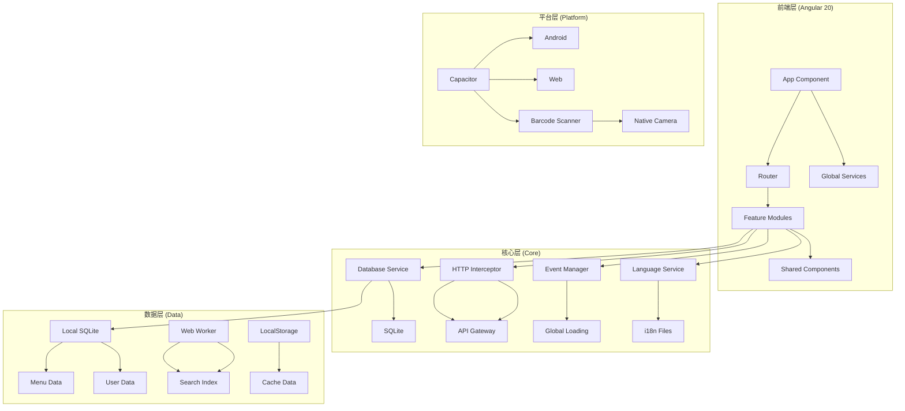
```mermaid
graph TB
    subgraph "前端层 (Angular 20)"
        A[App Component] --> B[Router]
        B --> C[Feature Modules]
        C --> D[Shared Components]
        A --> E[Global Services]
    end
    
    subgraph "核心层 (Core)"
        F[Database Service] --> G[SQLite]
        H[HTTP Interceptor] --> I[API Gateway]
        J[Event Manager] --> K[Global Loading]
        L[Language Service] --> M[i18n Files]
    end
    
    subgraph "数据层 (Data)"
        N[Local SQLite] --> O[Menu Data]
        N --> P[User Data]
        Q[Web Worker] --> R[Search Index]
        S[LocalStorage] --> T[Cache Data]
    end
    
    subgraph "平台层 (Platform)"
        U[Capacitor] --> V[Android]
        U --> W[Web]
        X[Barcode Scanner] --> Y[Native Camera]
    end
    
    C --> F
    C --> H
    C --> J
    C --> L
    F --> N
    H --> I
    Q --> R
    U --> X
```

### 4.2. 模块依赖关系图

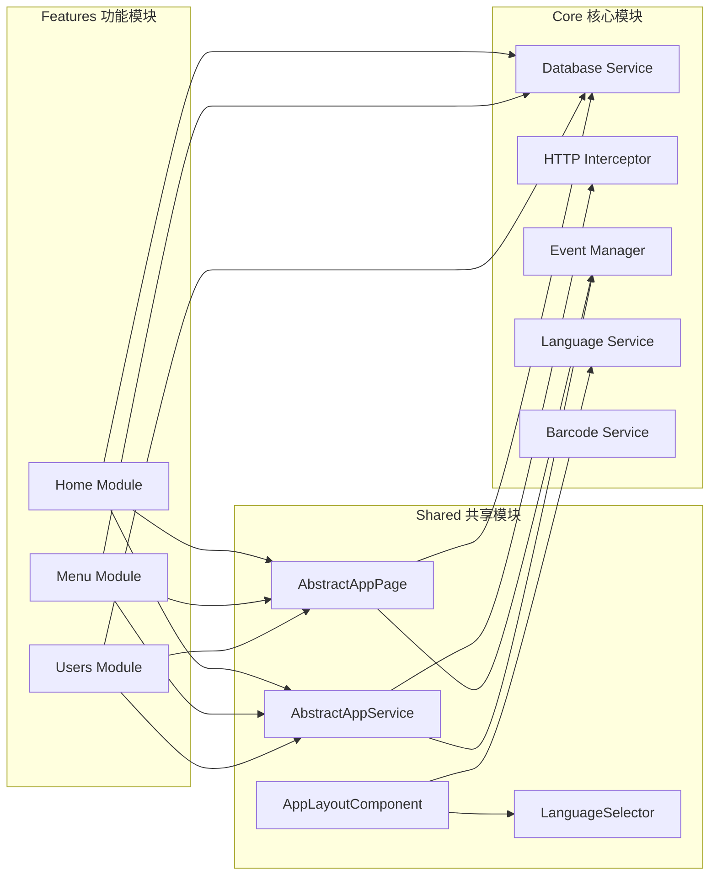
```mermaid
graph LR
    subgraph "Core 核心模块"
        A[Database Service]
        B[HTTP Interceptor]
        C[Event Manager]
        D[Language Service]
        E[Barcode Service]
    end
    
    subgraph "Shared 共享模块"
        F[AbstractAppPage]
        G[AbstractAppService]
        H[AppLayoutComponent]
        I[LanguageSelector]
    end
    
    subgraph "Features 功能模块"
        J[Home Module]
        K[Menu Module]
        L[Users Module]
    end
    
    J --> F
    J --> G
    K --> F
    K --> G
    L --> F
    L --> G
    
    F --> A
    F --> C
    G --> B
    G --> C
    
    H --> D
    H --> I
    
    J --> A
    K --> A
    L --> A
```

### 4.3. 核心运行机制

- **全局加载遮罩**: `shared/abstracts/abstract.app.service.ts` 的 `request()` 方法，在发起/结束 HTTP 请求时，通过 `core/constants/app.event.ts` 中定义的事件，通知根组件 `app.ts` 显示或隐藏全局加载遮罩。

- **Web Worker**: `features/menu/workers/menu.worker.ts` 负责在后台线程处理密集的菜单数据，构建搜索索引。相关的调用逻辑被封装在 `features/menu/services/` 中。

- **路由动画**: 定义在 `core/animations/route-animations.ts`，采用大屏友好的"侧滑"效果。通过在 `app.routes.ts` 中为路由添加 `data: { animation: 'pageName' }`，并由根组件 `app.html` 的 `[@routeAnimations]` 触发器绑定实现。

- **UI 统一**: 全局基础样式（如统一卡片 `.app-card`）定义在 `styles.scss` 中，可跨页面复用。

- **国际化**: 集成 `@ngx-translate/core`，在 `app.config.ts` 中注册自定义加载器，从 `assets/i18n/` 目录加载语言文件。

#### 4.3.1. 统一事件入口（UI Event Gateway）

为降低 onXxx 事件方法的膨胀与便于代码生成，`AbstractAppPage` 提供统一入口与分发：

用法：
```html
<!-- 模板中统一绑定，并为元素声明 data-id（建议用常量） -->
<button [attr.data-id]="HomeUi.syncMenu" (click)="onClick($event)">...</button>
<input [attr.data-id]="HomeUi.searchInput" (change)="onChange($event)" />
<form [attr.data-id]="UsersUi.dialogSubmit" (ngSubmit)="onSubmit($event)">...</form>
```

```ts
// 组件中注册 handler（推荐在 ngOnInit）
this.registerHandler(HomeUi.syncMenu, () => this.onSync());
this.registerHandler(HomeUi.searchInput, () => this.onSearch());
```

事件模型：
- 入口方法：`onClick(event) / onChange(event) / onSubmit(event)`
- 分发类型：`UiEvent = { type, key, payload?, originalEvent }`
- payload 兼容：原生事件与 Angular Material（MatSelectChange/MatCheckboxChange/PageEvent）
  - value、checked、name（可用时）
  - userId（从 `data-user-id` 自动注入）
  - pageEvent（分页事件）
- 钩子：`preDispatch(ev)`（返回 false 可拦截）、`postDispatch(ev)`（统一日志/埋点）

最佳实践：
- data-id 建议集中到常量：如 `features/home/types/home.types.ts` 的 `HomeUi`；`features/users/types/users.types.ts` 的 `UsersUi`
- 行级操作可通过附加 `data-user-id` 将上下文注入 payload

### 4.4. 数据库架构

#### 4.4.1. 数据库架构图

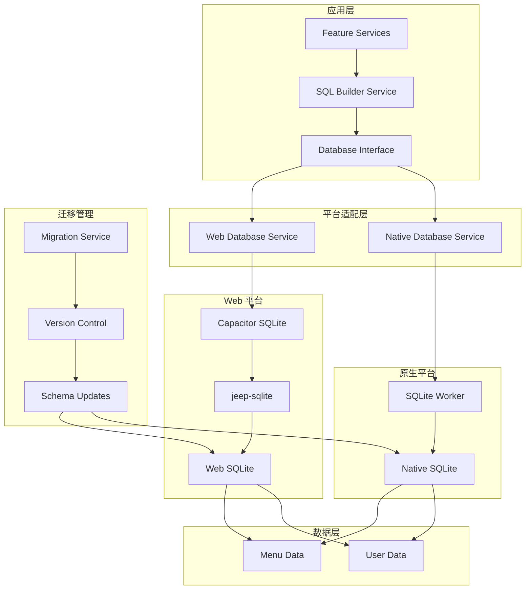
```mermaid
graph TB
    subgraph "应用层"
        A[Feature Services] --> B[SQL Builder Service]
        B --> C[Database Interface]
    end
    
    subgraph "平台适配层"
        C --> D[Web Database Service]
        C --> E[Native Database Service]
    end
    
    subgraph "Web 平台"
        D --> F[Capacitor SQLite]
        F --> G[jeep-sqlite]
        G --> H[Web SQLite]
    end
    
    subgraph "原生平台"
        E --> I[SQLite Worker]
        I --> J[Native SQLite]
    end
    
    subgraph "数据层"
        H --> K[Menu Data]
        H --> L[User Data]
        J --> K
        J --> L
    end
    
    subgraph "迁移管理"
        M[Migration Service] --> N[Version Control]
        N --> O[Schema Updates]
        O --> H
        O --> J
    end
```

#### 4.4.2. 数据库操作流程

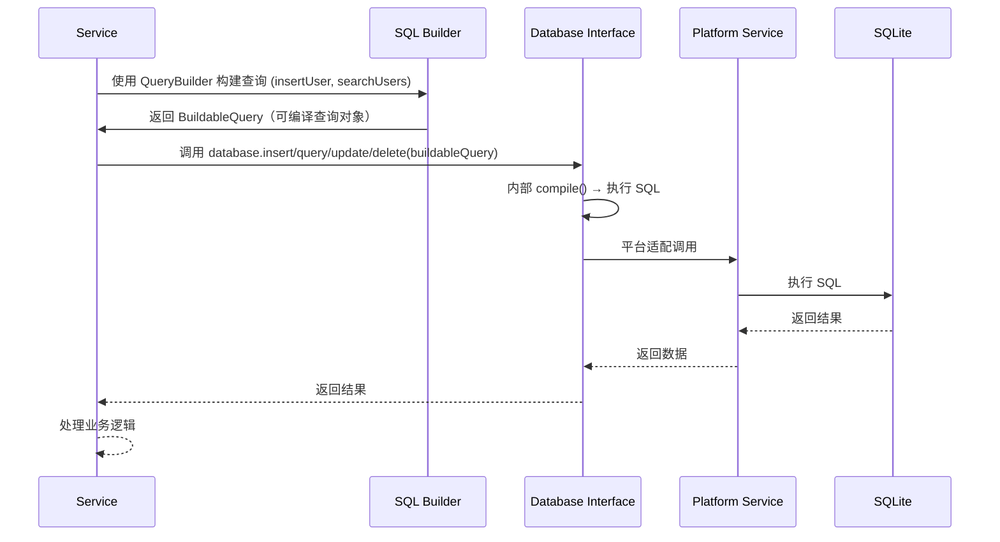
```mermaid
sequenceDiagram
    participant SVC as Service
    participant SQL as SQL Builder
    participant DB as Database Interface
    participant PLAT as Platform Service
    participant SQLITE as SQLite
    
    SVC->>SQL: 使用 QueryBuilder 构建查询 (insertUser, searchUsers)
    SQL->>SVC: 返回 BuildableQuery（可编译查询对象）
    SVC->>DB: 调用 database.insert/query/update/delete(buildableQuery)
    DB->>DB: 内部 compile() → 执行 SQL
    DB->>PLAT: 平台适配调用
    PLAT->>SQLITE: 执行 SQL
    SQLITE-->>PLAT: 返回结果
    PLAT-->>DB: 返回数据
    DB-->>SVC: 返回结果
    SVC-->>SVC: 处理业务逻辑
```

#### 4.4.3. 数据库接口特性

##### 4.4.3.1. 查询构建器架构设计

**分层架构**：
- **QueryBuilder**: 通用查询构建器类（核心层）
- **QueryService**: 业务查询服务（业务层）
- **DatabaseService**: 数据库执行服务（数据层）

```typescript
// 1. 使用通用查询构建器
const insertQuery = QueryBuilder.insertInto('users')
    .values({ name: '张三', email: 'zhangsan@example.com' })
    .compile();

const selectQuery = QueryBuilder.selectFrom('users')
    .selectAll()
    .where('status', SqlOperator.EQ, 'active')
    .orderBy('created_at', 'desc')
    .limit(10)
    .compile();

// 2. 通过数据库服务执行
const result = await database.insert(insertQuery);
const users = await database.query<UserModel>(selectQuery);

// 3. 使用业务查询服务（推荐）
const userQueryService = inject(UserQueryService);
const searchQuery = userQueryService.searchUsers({ 
    keyword: '张三', 
    page: 1, 
    pageSize: 10 
});
const searchResults = await database.query<UserModel>(searchQuery);
```

##### 4.4.3.2. 业务查询服务示例
```typescript
// 菜单查询服务
@Injectable({ providedIn: 'root' })
export class MenuQueryService {
    searchMenus(keyword?: string): CompiledQuery {
        let query = QueryBuilder.selectFrom('menus').selectAll();
        
        if (keyword && keyword.trim()) {
            query = query.where('name', SqlOperator.LIKE, `%${keyword}%`);
        }
        
        return query
            .orderBy('category', 'asc')
            .orderBy('name', 'asc')
            .compile();
    }
    
    insertMenus(menus: MenuData[]): CompiledQuery {
        return QueryBuilder.insertInto('menus')
            .valuesList(menus)
            .compile();
    }
}

// 用户查询服务
@Injectable({ providedIn: 'root' })
export class UserQueryService {
    searchUsers(filters: UserSearchFilters): CompiledQuery {
        let query = QueryBuilder.selectFrom('users').selectAll();
        
        if (filters.keyword) {
            query = query.where('name', SqlOperator.LIKE, `%${filters.keyword}%`);
        }
        if (filters.gender) {
            query = query.andWhere('gender', SqlOperator.EQ, filters.gender);
        }
        
        return query
            .orderBy('created_at', 'desc')
            .limit(filters.pageSize || 10)
            .offset((filters.page || 1 - 1) * (filters.pageSize || 10))
            .compile();
    }
}
```

##### 4.4.3.2. 事务管理
```typescript
// 手动事务管理
await database.beginTransaction();
try {
    await database.insert('INSERT INTO users ...', params1);
    await database.update('UPDATE orders ...', params2);
    await database.commit();
} catch (error) {
    await database.rollback();
    throw error;
}

// 自动事务管理
const result = await database.transaction(async () => {
    const user = await database.insert('INSERT INTO users ...', params1);
    const order = await database.insert('INSERT INTO orders ...', params2);
    return { user, order };
});
```

##### 4.4.3.3. 批量插入优化
```typescript
// 批量插入配置
interface BatchInsertConfig {
    batchSize?: number;        // 每批处理条数，默认1000
    commitPerBatch?: boolean;  // 是否每批提交，默认true
    ignoreDuplicates?: boolean; // 是否忽略重复，默认false
}

// 使用示例
const config: BatchInsertConfig = {
    batchSize: 500,           // 每500条一批
    commitPerBatch: true,     // 每批自动提交
    ignoreDuplicates: false   // 不忽略重复数据
};

const result = await database.batchInsert(sql, dataList, config);
// result.totalInserted: 总插入条数
// result.totalBatches: 总批次数
// result.executionTime: 执行时间
```

#### 4.4.4. 架构特性

- **跨平台数据库**: 通过 `core/interfaces/database.interface.ts` 定义统一接口，支持Web和原生平台的不同实现
  - Web平台：使用 `web-database.service.ts` + `@capacitor-community/sqlite` + `jeep-sqlite`
  - 原生平台：使用 `database.service.ts` + Web Worker + SQLite
- **类型安全查询**: 通过 `core/builders/query-builder.ts` 基于Kysely提供类型安全的SQL构建
- **数据库迁移**: `core/services/migration.service.ts` 管理数据库版本升级和结构变更
- **模块化Schema**: 每个功能模块管理自己的Schema定义，通过`core/db/schema.ts`统一合并
- **DML操作优化**: 提供专用的`insert`、`update`、`delete`方法，支持批量插入和事务管理

#### 4.4.5. Schema 与类型文件结构（最新）

固定约定：
- 业务模型与字段常量集中在 `shared/types/[entity].shared.types.ts`
- 行类型（持久化结构）在各模块 `features/[module]/schemas/[entity].schema.ts` 中以 `NullifyOptionals<业务模型>` 派生，避免重复定义
- 查询构造统一使用 `QueryBuilder` + `Table/Fields` 常量，禁止魔法字符串

示例（用户）：
```ts
// shared/types/user.shared.types.ts
export interface UserModel {
  id: string;
  name: string;
  gender?: 'male' | 'female' | 'other';
  birthday?: string;
  email?: string;
  phone?: string;
  created_at?: string;
  updated_at?: string;
}

export const UserTable = 'users' as const;
export const UserFields = {
  id: 'id',
  name: 'name',
  gender: 'gender',
  birthday: 'birthday',
  email: 'email',
  phone: 'phone',
  created_at: 'created_at',
  updated_at: 'updated_at',
} as const;
export type UserFieldKey = keyof typeof UserFields;
```

```ts
// features/users/schemas/user.schema.ts
import type { NullifyOptionals } from '../../../shared/types/type-utils';
import type { UserModel } from '../../../shared/types/user.shared.types';

export type UserRow = NullifyOptionals<UserModel>;
export interface UserDB { users: UserRow; }
```

示例（菜单）：
```ts
// shared/types/menu.shared.types.ts
export interface MenuModel {
  id: string;
  name: string;
  category: string;
  price: number;
  tags?: string[];
  keywords?: string[];
  created_at?: string;
  updated_at?: string;
}

export const MenuTable = 'menus' as const;
export const MenuFields = {
  id: 'id', name: 'name', category: 'category', price: 'price',
  tags: 'tags', keywords: 'keywords', created_at: 'created_at', updated_at: 'updated_at',
} as const;
export type MenuFieldKey = keyof typeof MenuFields;
```

```ts
// features/menu/schemas/menu.schema.ts
import type { NullifyOptionals } from '../../../shared/types/type-utils';
import type { MenuModel } from '../../../shared/types/menu.shared.types';

export type MenuRow = NullifyOptionals<MenuModel>;
export interface MenuDB { menus: MenuRow; }
```

查询构建（使用常量，数据库服务内部 compile）：
```ts
// 示例：按名称模糊查询用户，按创建时间倒序
let q = QueryBuilder.selectFrom(UserTable).selectAll();
q = q.where(UserFields.name, SqlOperator.LIKE, `%${keyword}%`).orderBy(UserFields.created_at, 'desc');
const rows = await database.query<UserRow>(q);
```

### 4.5. 服务架构

#### 4.5.1. 服务架构图

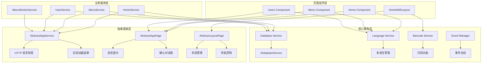
```mermaid
graph TB
    subgraph "抽象基类层"
        A[AbstractAppService] --> B[HTTP 请求处理]
        A --> C[全局加载遮罩]
        D[AbstractAppPage] --> E[消息提示]
        D --> F[确认对话框]
        G[AbstractLayoutPage] --> H[布局管理]
        G --> I[导航控制]
    end
    
    subgraph "业务服务层"
        J[HomeService] --> A
        K[MenuService] --> A
        L[UserService] --> A
        M[MenuWorkerService] --> A
    end
    
    subgraph "页面组件层"
        N[Home Component] --> D
        O[Menu Component] --> D
        P[Users Component] --> D
        Q[HomeWithLayout] --> G
    end
    
    subgraph "核心服务层"
        R[Database Service] --> S[IDatabaseService]
        T[Language Service] --> U[多语言管理]
        V[Barcode Service] --> W[扫码功能]
        X[Event Manager] --> Y[事件总线]
    end
    
    J --> R
    K --> R
    L --> R
    N --> T
    O --> T
    P --> T
    Q --> V
```

#### 4.5.2. 服务依赖注入流程

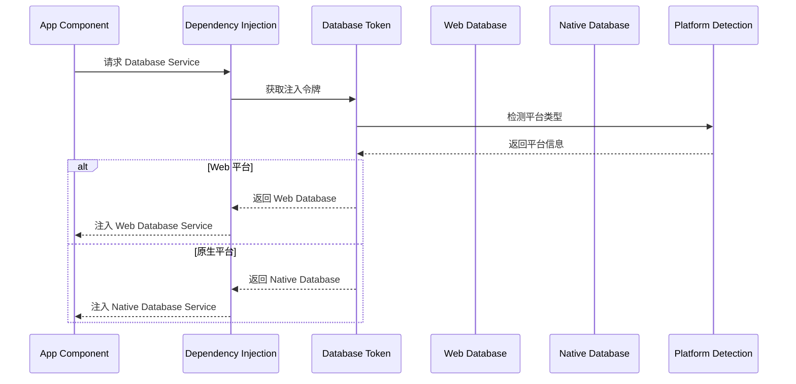
```mermaid
sequenceDiagram
    participant APP as App Component
    participant DI as Dependency Injection
    participant TOKEN as Database Token
    participant WEB as Web Database
    participant NATIVE as Native Database
    participant PLAT as Platform Detection
    
    APP->>DI: 请求 Database Service
    DI->>TOKEN: 获取注入令牌
    TOKEN->>PLAT: 检测平台类型
    PLAT-->>TOKEN: 返回平台信息
    alt Web 平台
        TOKEN-->>DI: 返回 Web Database
        DI-->>APP: 注入 Web Database Service
    else 原生平台
        TOKEN-->>DI: 返回 Native Database
        DI-->>APP: 注入 Native Database Service
    end
```

#### 4.5.3. 架构特性

- **抽象基类**: 
  - `AbstractAppService`: 为业务服务提供统一的HTTP请求处理和全局加载遮罩管理
  - `AbstractAppPage`: 为页面组件提供统一的消息提示、确认对话框等功能
  - `AbstractLayoutPage`: 为页面组件提供统一的布局框架和导航功能
- **依赖注入**: 通过 `core/tokens/database.token.ts` 实现数据库服务的动态注入
- **单例服务**: 所有核心服务通过 `providedIn: 'root'` 提供单例实例

### 4.6. 布局框架设计

#### 4.6.1. 布局架构图

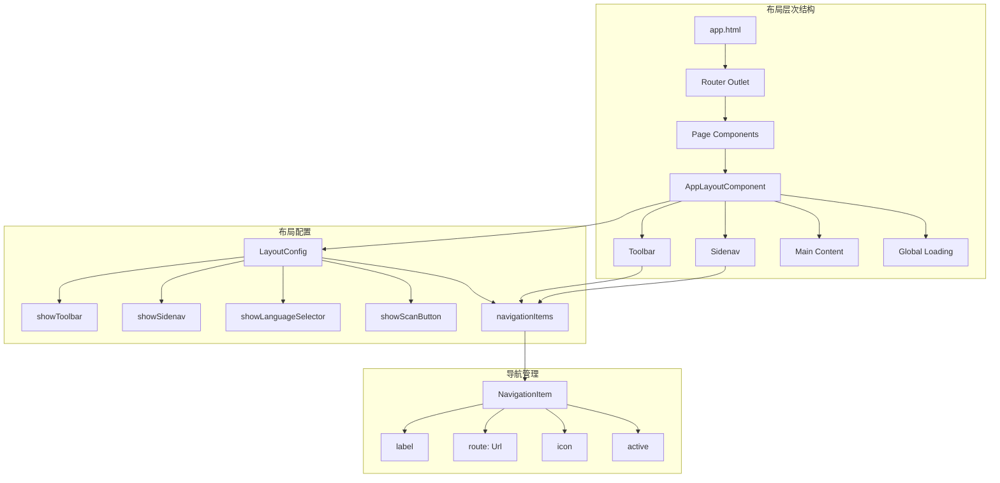
```mermaid
graph TB
    subgraph "布局层次结构"
        A[app.html] --> B[Router Outlet]
        B --> C[Page Components]
        C --> D[AppLayoutComponent]
        D --> E[Toolbar]
        D --> F[Sidenav]
        D --> G[Main Content]
        D --> H[Global Loading]
    end
    
    subgraph "布局配置"
        I[LayoutConfig] --> J[showToolbar]
        I --> K[showSidenav]
        I --> L[showLanguageSelector]
        I --> M[showScanButton]
        I --> N[navigationItems]
    end
    
    subgraph "导航管理"
        O[NavigationItem] --> P[label]
        O --> Q[route: Url]
        O --> R[icon]
        O --> S[active]
    end
    
    D --> I
    E --> N
    F --> N
    N --> O
```

#### 4.6.2. 布局组件交互流程

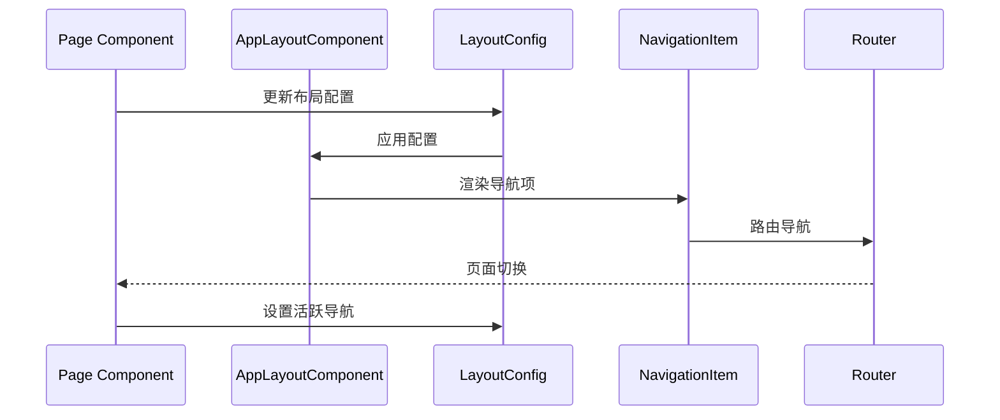
```mermaid
sequenceDiagram
    participant PAGE as Page Component
    participant LAYOUT as AppLayoutComponent
    participant CONFIG as LayoutConfig
    participant NAV as NavigationItem
    participant ROUTER as Router
    
    PAGE->>CONFIG: 更新布局配置
    CONFIG->>LAYOUT: 应用配置
    LAYOUT->>NAV: 渲染导航项
    NAV->>ROUTER: 路由导航
    ROUTER-->>PAGE: 页面切换
    PAGE->>CONFIG: 设置活跃导航
```

#### 4.6.3. 框架页方案选择

**推荐方案：分层框架设计**

1. **app.html**: 作为最基础的根布局，只包含路由出口
2. **AppLayoutComponent**: 可配置的布局框架组件
3. **AbstractLayoutPage**: 页面布局抽象基类

#### 4.4.2. 布局组件特性

- **可配置性**: 支持工具栏、侧边栏、导航等功能的开关控制
- **响应式设计**: 支持不同屏幕尺寸的适配
- **统一管理**: 导航、扫码、语言切换等功能的统一处理
- **灵活扩展**: 支持页面级别的布局定制

#### 4.4.3. 使用方式

```ts
// 方式一：继承 AbstractLayoutPage（推荐）
export class HomeComponent extends AbstractLayoutPage {
  ngOnInit(): void {
    this.setActiveNavigation(AppUrl.PAGE_HOME.value);
    this.updateLayoutConfig({
      toolbarTitle: '首页',
      showSidenav: false
    });
  }
}

// 方式二：直接使用 AppLayoutComponent
@Component({
  template: `
    <app-layout [config]="layoutConfig" (navigationClick)="onNav($event)">
      <div>页面内容</div>
    </app-layout>
  `
})
export class SomeComponent {
  layoutConfig: LayoutConfig = { /* 配置 */ };
}
```

### 请求/遮罩时序
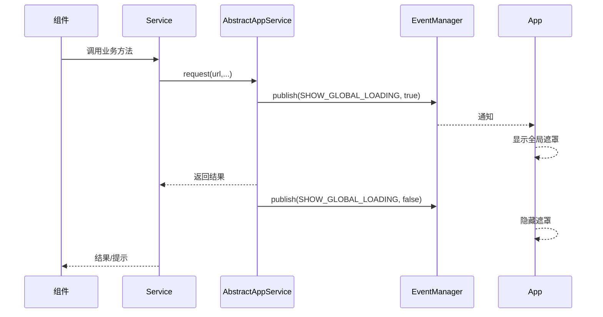
```mermaid
sequenceDiagram
  participant UI as 组件
  participant SVC as Service
  participant ABS as AbstractAppService
  participant EVT as EventManager
  participant APP as App
  UI->>SVC: 调用业务方法
  SVC->>ABS: request(url,...)
  ABS->>EVT: publish(SHOW_GLOBAL_LOADING, true)
  EVT-->>APP: 通知
  APP-->>APP: 显示全局遮罩
  ABS-->>SVC: 返回结果
  ABS->>EVT: publish(SHOW_GLOBAL_LOADING, false)
  APP-->>APP: 隐藏遮罩
  SVC-->>UI: 结果/提示
```

### Worker/菜单索引
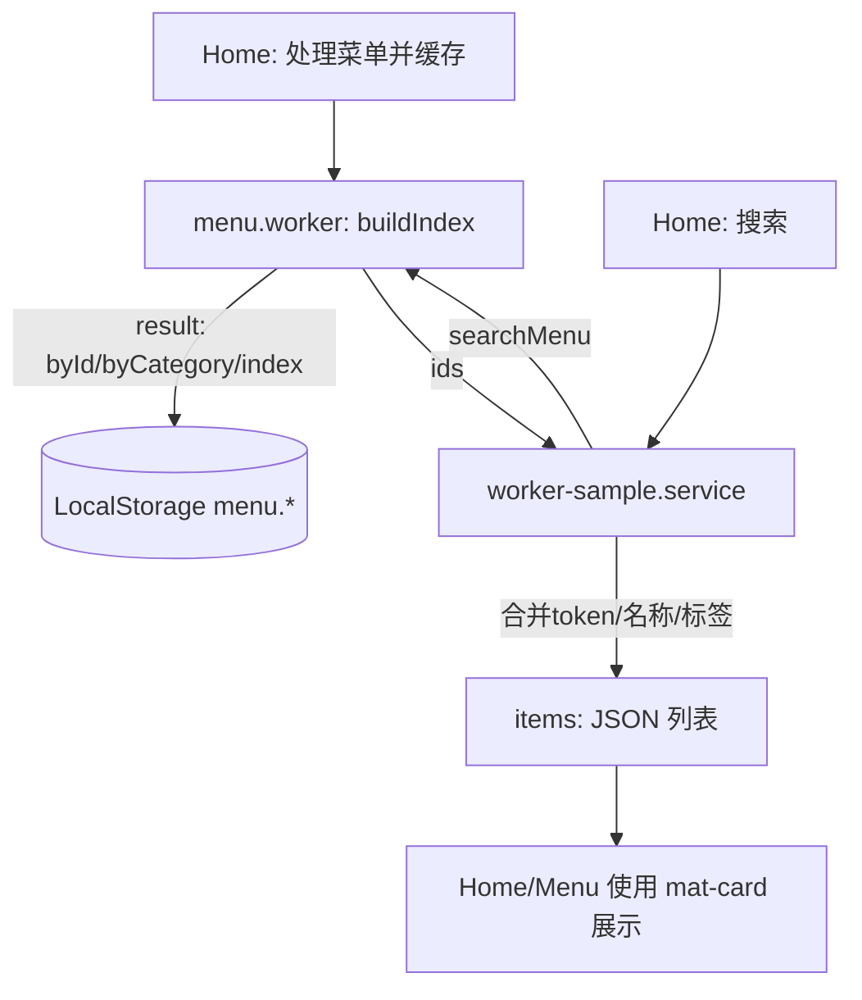
```mermaid
flowchart TB
  A[Home: 处理菜单并缓存] --> B[menu.worker: buildIndex]
  B -->|result: byId/byCategory/index| C[(LocalStorage menu.*)]
  D[Home: 搜索] --> E[worker-sample.service]
  E -->|searchMenu| B
  B -->|ids| E
  E -->|合并token/名称/标签| F[items: JSON 列表]
  F --> G[Home/Menu 使用 mat-card 展示]
```

## 5. 功能模块使用说明

### 5.1. 首页（Home）模块

#### 5.1.1. 菜单同步数据流

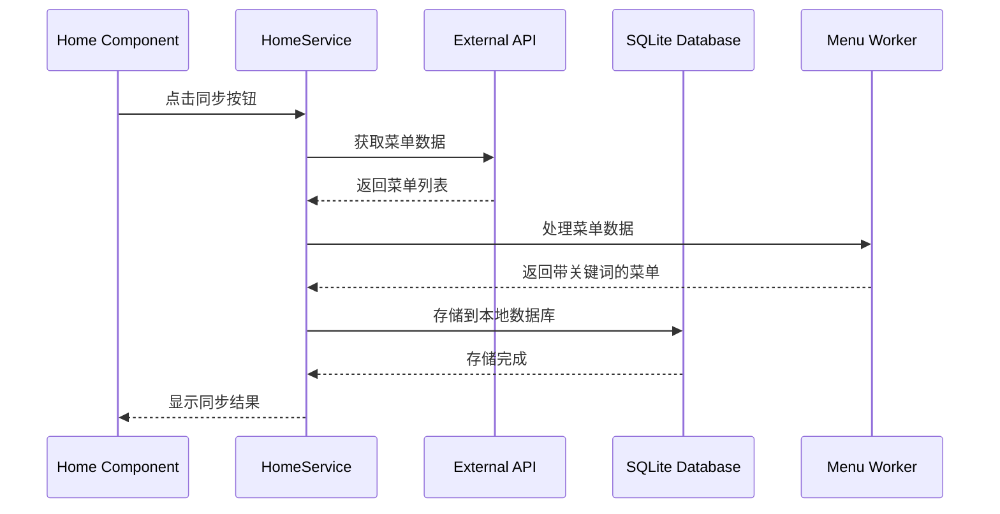
```mermaid
sequenceDiagram
    participant UI as Home Component
    participant SVC as HomeService
    participant API as External API
    participant DB as SQLite Database
    participant WORKER as Menu Worker
    
    UI->>SVC: 点击同步按钮
    SVC->>API: 获取菜单数据
    API-->>SVC: 返回菜单列表
    SVC->>WORKER: 处理菜单数据
    WORKER-->>SVC: 返回带关键词的菜单
    SVC->>DB: 存储到本地数据库
    DB-->>SVC: 存储完成
    SVC-->>UI: 显示同步结果
```

#### 5.1.2. 菜单搜索数据流

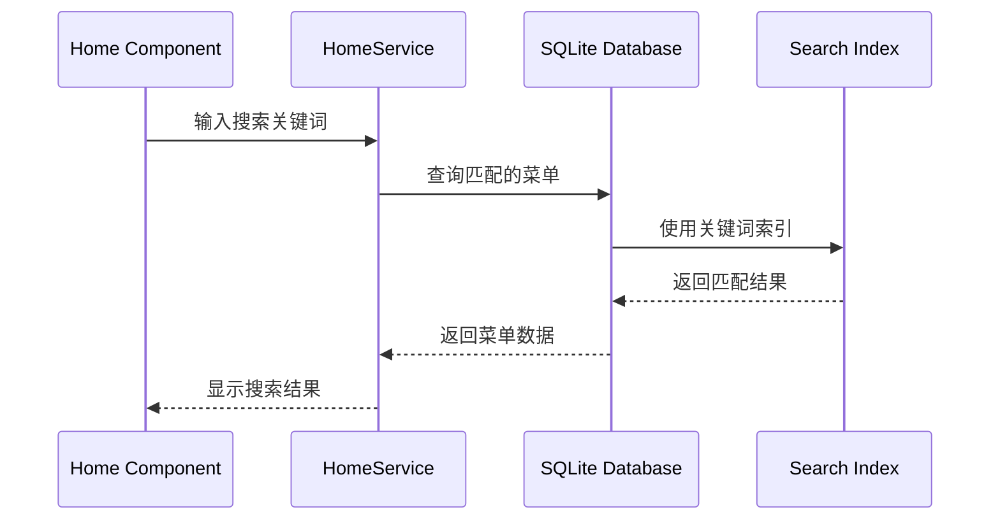
```mermaid
sequenceDiagram
    participant UI as Home Component
    participant SVC as HomeService
    participant DB as SQLite Database
    participant INDEX as Search Index
    
    UI->>SVC: 输入搜索关键词
    SVC->>DB: 查询匹配的菜单
    DB->>INDEX: 使用关键词索引
    INDEX-->>DB: 返回匹配结果
    DB-->>SVC: 返回菜单数据
    SVC-->>UI: 显示搜索结果
```

#### 5.1.3. 功能特性

- **菜单同步**: 点击"拉取最新菜单"按钮，从API获取菜单数据并同步到本地SQLite数据库
- **菜单搜索**: 输入关键字进行搜索，支持按名称、分类、标签、价格范围等关键词匹配
- **数据缓存**: 菜单数据存储在本地SQLite数据库中，支持离线使用

### 5.2. 菜单（Menu）模块

#### 5.2.1. 菜单展示数据流

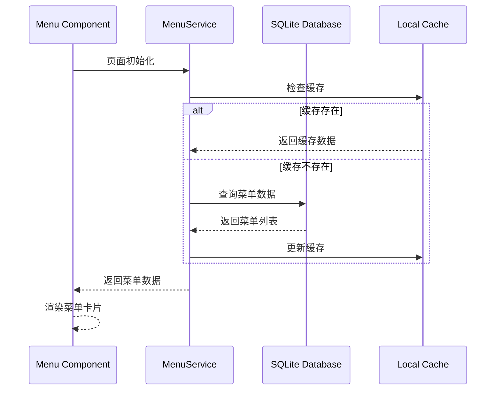
```mermaid
sequenceDiagram
    participant UI as Menu Component
    participant SVC as MenuService
    participant DB as SQLite Database
    participant CACHE as Local Cache
    
    UI->>SVC: 页面初始化
    SVC->>CACHE: 检查缓存
    alt 缓存存在
        CACHE-->>SVC: 返回缓存数据
    else 缓存不存在
        SVC->>DB: 查询菜单数据
        DB-->>SVC: 返回菜单列表
        SVC->>CACHE: 更新缓存
    end
    SVC-->>UI: 返回菜单数据
    UI-->>UI: 渲染菜单卡片
```

#### 5.2.2. 功能特性

- **菜单展示**: 以Material Design卡片形式展示所有菜单项
- **分类展示**: 按分类组织菜单，便于浏览
- **数据来源**: 从本地SQLite数据库读取菜单数据

### 5.3. 用户管理（Users）模块

#### 5.3.1. 用户CRUD操作流程

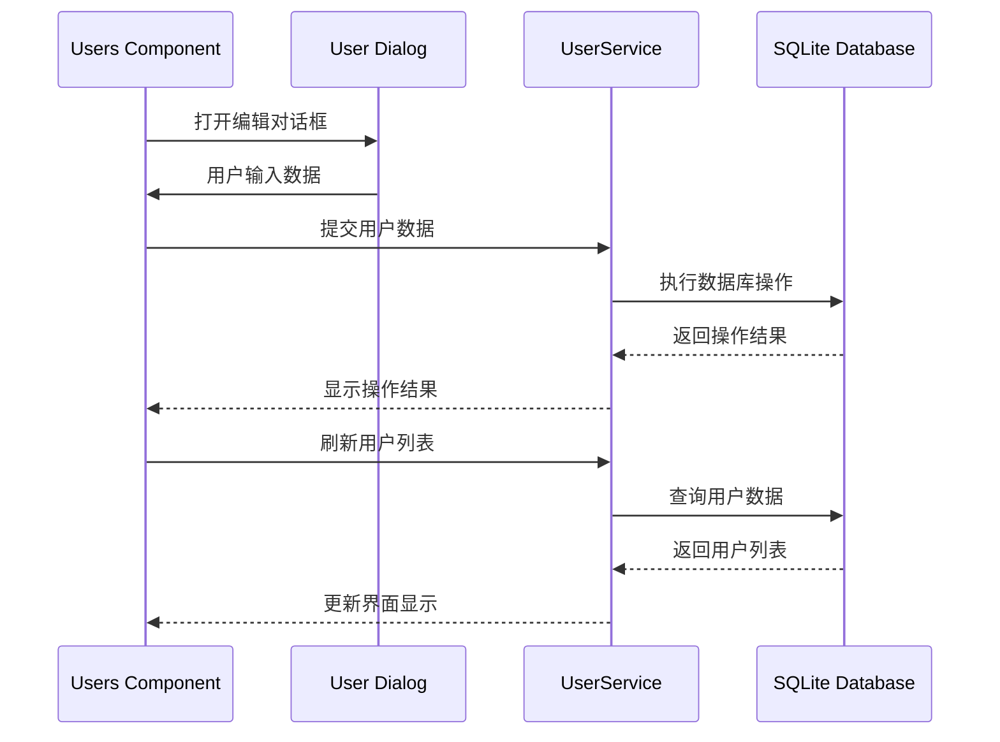
```mermaid
sequenceDiagram
    participant UI as Users Component
    participant DIALOG as User Dialog
    participant SVC as UserService
    participant DB as SQLite Database
    
    UI->>DIALOG: 打开编辑对话框
    DIALOG->>UI: 用户输入数据
    UI->>SVC: 提交用户数据
    SVC->>DB: 执行数据库操作
    DB-->>SVC: 返回操作结果
    SVC-->>UI: 显示操作结果
    UI->>SVC: 刷新用户列表
    SVC->>DB: 查询用户数据
    DB-->>SVC: 返回用户列表
    SVC-->>UI: 更新界面显示
```

#### 5.3.2. 功能特性

- **用户列表**: 以表格形式展示用户信息，支持分页显示
- **用户操作**: 支持用户的增删改查操作
- **搜索筛选**: 支持按姓名、性别、生日范围等条件筛选用户
- **批量操作**: 支持批量删除用户

### 5.4. 扫码功能

#### 5.4.1. 扫码操作流程

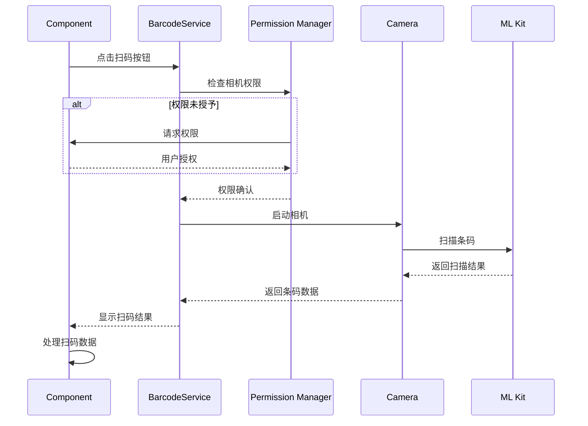
```mermaid
sequenceDiagram
    participant UI as Component
    participant SVC as BarcodeService
    participant PERM as Permission Manager
    participant CAM as Camera
    participant ML as ML Kit
    
    UI->>SVC: 点击扫码按钮
    SVC->>PERM: 检查相机权限
    alt 权限未授予
        PERM->>UI: 请求权限
        UI-->>PERM: 用户授权
    end
    PERM-->>SVC: 权限确认
    SVC->>CAM: 启动相机
    CAM->>ML: 扫描条码
    ML-->>CAM: 返回扫描结果
    CAM-->>SVC: 返回条码数据
    SVC-->>UI: 显示扫码结果
    UI->>UI: 处理扫码数据
```

#### 5.4.2. 功能特性

- **扫码服务**: `BarcodeService` 封装了 `@capacitor-mlkit/barcode-scanning` 插件
- **权限管理**: 自动请求相机权限
- **多格式支持**: 支持二维码、条形码等多种格式
- **使用方式**: 根组件提供"开始扫码"按钮，可直接调用扫码功能

### 5.5. 多语言支持

#### 5.5.1. 语言切换流程

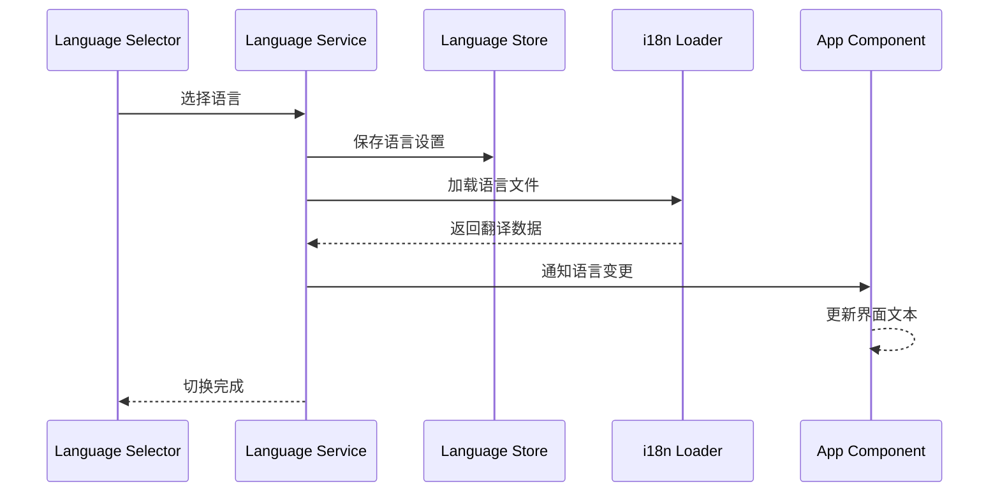
```mermaid
sequenceDiagram
    participant UI as Language Selector
    participant SVC as Language Service
    participant STORE as Language Store
    participant I18N as i18n Loader
    participant APP as App Component
    
    UI->>SVC: 选择语言
    SVC->>STORE: 保存语言设置
    SVC->>I18N: 加载语言文件
    I18N-->>SVC: 返回翻译数据
    SVC->>APP: 通知语言变更
    APP-->>APP: 更新界面文本
    SVC-->>UI: 切换完成
```

#### 5.5.2. 功能特性

- **语言切换**: 通过右上角的语言选择器切换应用语言
- **支持语言**: 中文简体、中文繁体、英文
- **实时切换**: 语言切换后立即生效，无需重启应用

## 6. 数据库迁移管理

### 6.1. 迁移系统架构

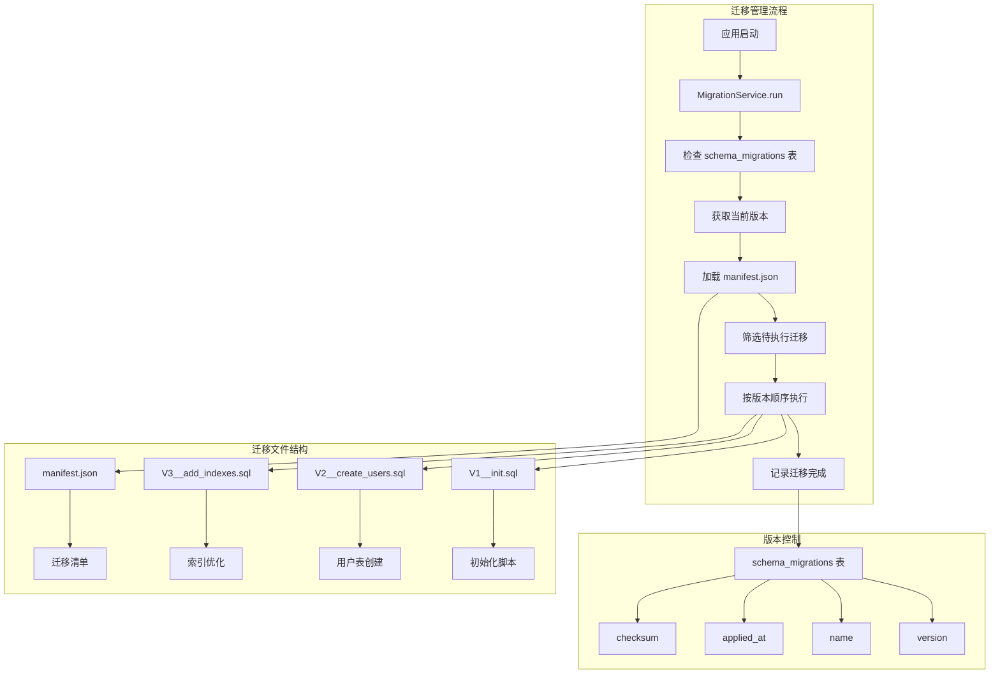
```mermaid
graph TB
    subgraph "迁移管理流程"
        A[应用启动] --> B[MigrationService.run]
        B --> C[检查 schema_migrations 表]
        C --> D[获取当前版本]
        D --> E[加载 manifest.json]
        E --> F[筛选待执行迁移]
        F --> G[按版本顺序执行]
        G --> H[记录迁移完成]
    end
    
    subgraph "迁移文件结构"
        I[manifest.json] --> J[迁移清单]
        K[V1__init.sql] --> L[初始化脚本]
        M[V2__create_users.sql] --> N[用户表创建]
        O[V3__add_indexes.sql] --> P[索引优化]
    end
    
    subgraph "版本控制"
        Q[schema_migrations 表] --> R[version]
        Q --> S[name]
        Q --> T[applied_at]
        Q --> U[checksum]
    end
    
    E --> I
    G --> K
    G --> M
    G --> O
    H --> Q
```

### 6.2. 迁移文件组织

#### 6.2.1. 目录结构
```
src/assets/db/migrations/
├── manifest.json          # 迁移清单文件
├── V1__init.sql          # 版本1：初始化脚本
├── V2__create_users.sql  # 版本2：创建用户表
├── V3__add_indexes.sql   # 版本3：添加索引
└── V4__alter_menus.sql   # 版本4：修改菜单表结构
```

#### 6.2.2. 迁移文件命名规范
- **格式**: `V{版本号}__{描述}.sql`
- **版本号**: 递增的整数，从1开始
- **描述**: 使用下划线分隔的英文描述
- **示例**: `V1__init.sql`, `V2__create_users.sql`, `V3__add_indexes.sql`

### 6.3. 创建新的数据库迁移

#### 6.3.1. 迁移创建流程

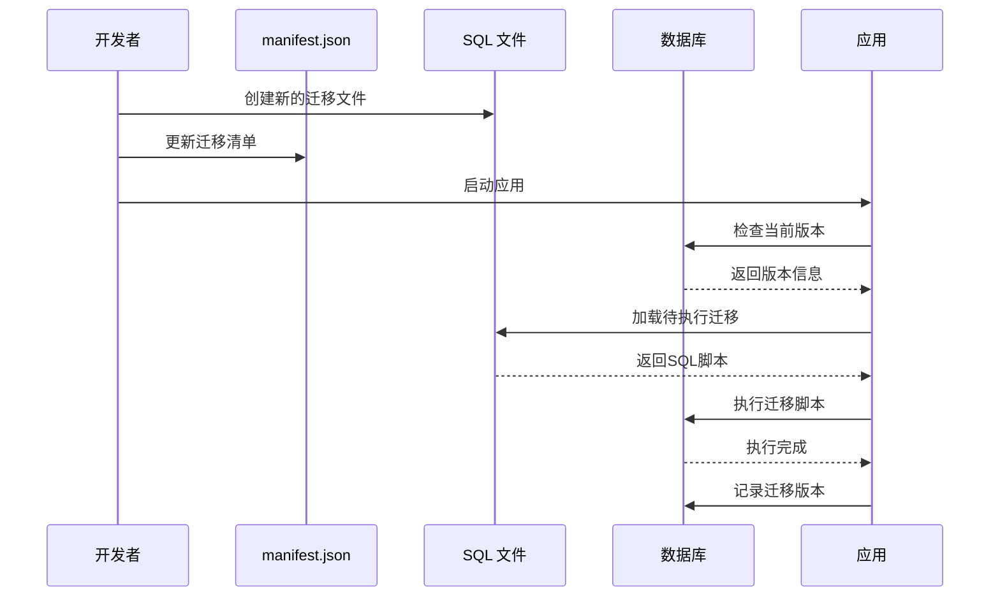
```mermaid
sequenceDiagram
    participant DEV as 开发者
    participant MANIFEST as manifest.json
    participant SQL as SQL 文件
    participant DB as 数据库
    participant APP as 应用
    
    DEV->>SQL: 创建新的迁移文件
    DEV->>MANIFEST: 更新迁移清单
    DEV->>APP: 启动应用
    APP->>DB: 检查当前版本
    DB-->>APP: 返回版本信息
    APP->>SQL: 加载待执行迁移
    SQL-->>APP: 返回SQL脚本
    APP->>DB: 执行迁移脚本
    DB-->>APP: 执行完成
    APP->>DB: 记录迁移版本
```

#### 6.3.2. 步骤详解

**步骤1: 创建迁移SQL文件**
```bash
# 在 src/assets/db/migrations/ 目录下创建新文件
# 例如：V3__add_user_indexes.sql
```

**步骤2: 编写迁移SQL**
```sql
-- V3__add_user_indexes.sql
-- 为用户表添加复合索引

CREATE INDEX IF NOT EXISTS idx_users_name_gender 
ON users(name, gender);

CREATE INDEX IF NOT EXISTS idx_users_birthday_range 
ON users(birthday) WHERE birthday IS NOT NULL;

-- 添加新的用户状态字段
ALTER TABLE users ADD COLUMN status TEXT DEFAULT 'active';
```

**步骤3: 更新manifest.json**
```json
{
    "migrations": [
        { "version": 1, "name": "init", "file": "V1__init.sql", "type": "sql" },
        { "version": 2, "name": "create_users", "file": "V2__create_users.sql", "type": "sql" },
        { "version": 3, "name": "add_user_indexes", "file": "V3__add_user_indexes.sql", "type": "sql" }
    ]
}
```

**步骤4: 更新TypeScript类型定义**
```typescript
// src/app/core/db/schema.ts
export interface DB {
    users: {
        id: string;
        name: string;
        gender: string | null;
        birthday: string | null;
        email: string | null;
        phone: string | null;
        status: string | null;  // 新增字段
        created_at: string | null;
        updated_at: string | null;
    };
    // ... 其他表定义
}
```

### 6.4. 常见迁移场景

#### 6.4.1. 创建新表
```sql
-- V4__create_orders.sql
CREATE TABLE IF NOT EXISTS orders (
    id TEXT PRIMARY KEY NOT NULL,
    user_id TEXT NOT NULL,
    total_amount REAL NOT NULL,
    status TEXT DEFAULT 'pending',
    created_at TEXT DEFAULT (datetime('now')),
    updated_at TEXT,
    FOREIGN KEY (user_id) REFERENCES users(id)
);

-- 创建索引
CREATE INDEX IF NOT EXISTS idx_orders_user_id ON orders(user_id);
CREATE INDEX IF NOT EXISTS idx_orders_status ON orders(status);
CREATE INDEX IF NOT EXISTS idx_orders_created_at ON orders(created_at);
```

#### 6.4.2. 添加新字段
```sql
-- V5__add_menu_description.sql
ALTER TABLE menus ADD COLUMN description TEXT;
ALTER TABLE menus ADD COLUMN image_url TEXT;
ALTER TABLE menus ADD COLUMN is_available INTEGER DEFAULT 1;
```

#### 6.4.3. 修改字段类型（SQLite限制）
```sql
-- V6__rebuild_menus_table.sql
-- SQLite不支持直接修改字段类型，需要重建表

-- 1. 创建新表
CREATE TABLE menus_new (
    id TEXT PRIMARY KEY NOT NULL,
    name TEXT NOT NULL,
    category TEXT NOT NULL,
    price INTEGER NOT NULL,  -- 改为整数（分）
    description TEXT,
    image_url TEXT,
    is_available INTEGER DEFAULT 1,
    tags TEXT,
    keywords TEXT
);

-- 2. 复制数据（价格转换：元转分）
INSERT INTO menus_new (id, name, category, price, description, image_url, is_available, tags, keywords)
SELECT 
    id, 
    name, 
    category, 
    CAST(price * 100 AS INTEGER),  -- 元转分
    NULL,  -- 新字段默认值
    NULL,
    1,
    tags,
    keywords
FROM menus;

-- 3. 删除旧表
DROP TABLE menus;

-- 4. 重命名新表
ALTER TABLE menus_new RENAME TO menus;

-- 5. 重建索引
CREATE INDEX IF NOT EXISTS idx_menus_category ON menus(category);
CREATE INDEX IF NOT EXISTS idx_menus_price ON menus(price);
```

#### 6.4.4. 数据迁移
```sql
-- V7__migrate_user_data.sql
-- 为现有用户设置默认状态
UPDATE users SET status = 'active' WHERE status IS NULL;

-- 为现有菜单设置默认可用性
UPDATE menus SET is_available = 1 WHERE is_available IS NULL;
```

### 6.5. 迁移最佳实践

#### 6.5.1. 迁移设计原则
- **向后兼容**: 新迁移不应破坏现有数据
- **原子性**: 每个迁移应该是一个完整的操作单元
- **可回滚**: 设计时考虑如何回滚（虽然当前系统不自动支持）
- **版本递增**: 版本号必须严格递增，不能重复

#### 6.5.2. SQL编写规范
```sql
-- ✅ 好的实践
CREATE TABLE IF NOT EXISTS new_table (
    id TEXT PRIMARY KEY NOT NULL,
    name TEXT NOT NULL,
    created_at TEXT DEFAULT (datetime('now'))
);

-- ✅ 使用事务（SQLite自动支持）
BEGIN TRANSACTION;
    -- 多个相关操作
    CREATE TABLE temp_table (...);
    INSERT INTO temp_table SELECT ... FROM old_table;
    DROP TABLE old_table;
    ALTER TABLE temp_table RENAME TO new_table;
COMMIT;

-- ❌ 避免的做法
CREATE TABLE new_table (...);  -- 没有 IF NOT EXISTS
DROP TABLE old_table;          -- 没有备份数据
```

#### 6.5.3. 测试迁移
```typescript
// 在开发环境中测试迁移
async testMigration() {
    try {
        // 1. 备份当前数据库
        await this.backupDatabase();
        
        // 2. 运行迁移
        await this.migrationService.run();
        
        // 3. 验证数据结构
        await this.verifySchema();
        
        // 4. 验证数据完整性
        await this.verifyDataIntegrity();
        
        console.log('迁移测试通过');
    } catch (error) {
        console.error('迁移测试失败:', error);
        // 恢复备份
        await this.restoreDatabase();
    }
}
```

### 6.6. 迁移监控与调试

#### 6.6.1. 查看迁移状态
```sql
-- 查看已应用的迁移
SELECT * FROM schema_migrations ORDER BY version;

-- 查看当前数据库版本
SELECT MAX(version) as current_version FROM schema_migrations;
```

#### 6.6.2. 迁移日志
```typescript
// 在MigrationService中添加日志
private async applySqlMigration(m: ManifestItem): Promise<void> {
    console.log(`开始执行迁移: V${m.version} ${m.name}`);
    const startTime = Date.now();
    
    try {
        const url = this.migrationsBaseUrl + m.file;
        const resp = await fetch(url, { cache: 'no-cache' });
        if (!resp.ok) throw new Error(`Failed to load migration file: ${m.file}`);
        
        const text = await resp.text();
        await this.database.execute(text);
        
        const duration = Date.now() - startTime;
        console.log(`迁移完成: V${m.version} ${m.name} (${duration}ms)`);
    } catch (error) {
        console.error(`迁移失败: V${m.version} ${m.name}`, error);
        throw error;
    }
}
```

### 6.7. 生产环境部署

#### 6.7.1. 部署前检查清单
- [ ] 所有迁移文件已添加到 `manifest.json`
- [ ] 迁移SQL语法正确，已本地测试
- [ ] TypeScript类型定义已更新
- [ ] 相关业务代码已适配新结构
- [ ] 数据库备份已完成

#### 6.7.2. 部署流程
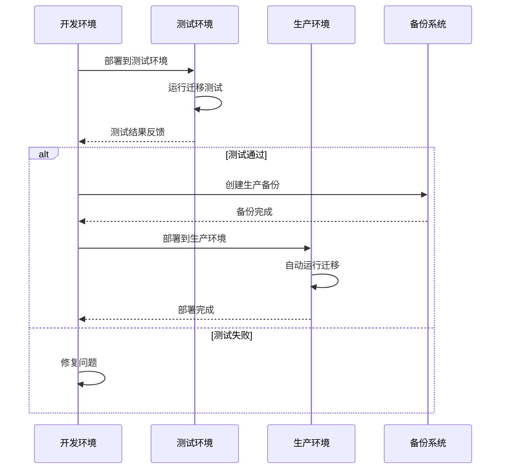
```mermaid
sequenceDiagram
    participant DEV as 开发环境
    participant TEST as 测试环境
    participant PROD as 生产环境
    participant BACKUP as 备份系统
    
    DEV->>TEST: 部署到测试环境
    TEST->>TEST: 运行迁移测试
    TEST-->>DEV: 测试结果反馈
    
    alt 测试通过
        DEV->>BACKUP: 创建生产备份
        BACKUP-->>DEV: 备份完成
        DEV->>PROD: 部署到生产环境
        PROD->>PROD: 自动运行迁移
        PROD-->>DEV: 部署完成
    else 测试失败
        DEV->>DEV: 修复问题
    end
```

## 7. 环境与配置

- `angular.json` 已配置：
  - `defaultConfiguration: development`
  - `dev/mock/production` 的 `fileReplacements`
- 国际化资源路径可在 `environment.i18nPathKey` 配置（默认 `/assets/i18n/`）。
- Capacitor `webDir` 指向 `dist/cross-platform-app/browser`，构建后 `npx cap copy android` 自动同步资源。

## 8. 编码规范（关键摘录）

- 命名：
  - 变量/函数用完整可读的单词，不用缩写；函数用动词短语，变量用名词短语。
  - 例如：`onMenuProcess`、`searchItems`、`getRouteAnimationData`。
- 组件职责：
  - 仅负责视图与用户交互（信号、绑定、事件转发），业务/网络请求放 `service`。
- 控制流：
  - 优先早返回；错误优先处理；避免深层嵌套。
- 注释：
  - 解释"为什么"，非"如何"；避免无意义注释；复杂块前置注释。
- 样式：
  - 统一使用全局类（如 `.app-card`、`.toolbar-spacer`）和组件局部样式；避免内联样式。
- 模板：
  - 使用内置控制流（`@if/@for/@switch`），少用旧的 `*ngIf/*ngFor/*ngSwitch`。
  - 遵循 Angular 17+ 的新控制流语法，提供更好的性能和类型安全。

## 9. 基于现有架构新增功能（最佳实践）

### 9.0. 新功能开发流程图

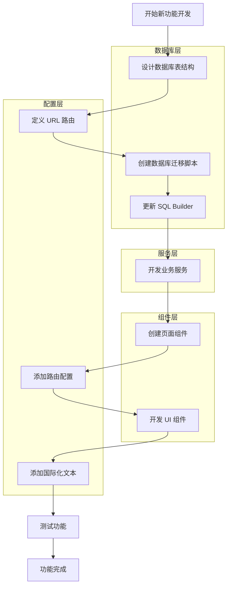
```mermaid
flowchart TD
    A[开始新功能开发] --> B[设计数据库表结构]
    B --> C[定义 URL 路由]
    C --> D[创建数据库迁移脚本]
    D --> E[更新 SQL Builder]
    E --> F[开发业务服务]
    F --> G[创建页面组件]
    G --> H[添加路由配置]
    H --> I[开发 UI 组件]
    I --> J[添加国际化文本]
    J --> K[测试功能]
    K --> L[功能完成]
    
    subgraph "数据库层"
        B
        D
        E
    end
    
    subgraph "服务层"
        F
    end
    
    subgraph "组件层"
        G
        I
    end
    
    subgraph "配置层"
        C
        H
        J
    end
```

以新增"订单（orders）"为例：

### 9.1. 生成页面组件
```bash
ng g c features/orders/order-list --standalone --style=scss --skip-tests
```

### 9.2. 路由配置
```ts
// app.routes.ts
{ 
  path: 'orders', 
  loadComponent: () => import('./features/orders/order-list').then(m => m.OrderList), 
  data: { animation: 'orders' } 
}
```

### 9.3. 服务层开发

#### 9.3.1. 业务查询服务
```ts
// 订单查询服务
@Injectable({ providedIn: 'root' })
export class OrderQueryService {
  createOrder(order: OrderData): CompiledQuery {
    return QueryBuilder.insertInto('orders')
      .values({
        id: order.id,
        user_id: order.userId,
        total_amount: order.total,
        status: order.status,
        created_at: new Date().toISOString()
      })
      .compile();
  }

  batchCreateOrders(orders: OrderData[]): CompiledQuery {
    return QueryBuilder.insertInto('orders')
      .valuesList(orders.map(order => ({
        id: order.id,
        user_id: order.userId,
        total_amount: order.total,
        status: order.status,
        created_at: new Date().toISOString()
      })))
      .compile();
  }

  updateOrder(order: OrderData): CompiledQuery {
    return QueryBuilder.updateTable('orders')
      .set({
        total_amount: order.total,
        status: order.status,
        updated_at: new Date().toISOString()
      })
      .where('id', SqlOperator.EQ, order.id)
      .compile();
  }

  deleteOrder(orderId: string): CompiledQuery {
    return QueryBuilder.deleteFrom('orders')
      .where('id', SqlOperator.EQ, orderId)
      .compile();
  }

  searchOrders(params: OrderSearchParams): CompiledQuery {
    let query = QueryBuilder.selectFrom('orders')
      .select(['id', 'user_id', 'total_amount', 'status', 'created_at']);

    if (params.userId) {
      query = query.where('user_id', SqlOperator.EQ, params.userId);
    }
    if (params.status) {
      query = query.andWhere('status', SqlOperator.EQ, params.status);
    }
    if (params.startDate) {
      query = query.andWhere('created_at', SqlOperator.GE, params.startDate);
    }
    if (params.endDate) {
      query = query.andWhere('created_at', SqlOperator.LE, params.endDate);
    }

    return query
      .orderBy('created_at', 'desc')
      .limit(params.limit || 50)
      .compile();
  }
}
```

#### 9.3.2. 业务服务
```ts
@Injectable({ providedIn: 'root' })
export class OrderService extends AbstractAppService {
  constructor(
    @Inject(DATABASE_SERVICE) private readonly database: IDatabaseService,
    private readonly orderQueryService: OrderQueryService,
  ) {
    super();
  }

  async create(order: OrderData): Promise<void> {
    const query = this.orderQueryService.createOrder(order);
    await this.database.insert(query);
  }

  async batchCreate(orders: OrderData[]): Promise<BatchInsertResult> {
    const query = this.orderQueryService.batchCreateOrders(orders);
    return await this.database.batchInsert(query, { 
      batchSize: 500, 
      commitPerBatch: true 
    });
  }

  async update(order: OrderData): Promise<void> {
    const query = this.orderQueryService.updateOrder(order);
    await this.database.update(query);
  }

  async delete(orderId: string): Promise<void> {
    const query = this.orderQueryService.deleteOrder(orderId);
    await this.database.delete(query);
  }

  async search(params: OrderSearchParams): Promise<OrderData[]> {
    const query = this.orderQueryService.searchOrders(params);
    const rows = await this.database.query<any>(query);
    return rows.map(this.mapToOrderData);
  }

  async createOrderWithItems(order: OrderData, items: OrderItem[]): Promise<void> {
    return await this.database.transaction(async () => {
      // 创建订单
      await this.create(order);
      
      // 批量创建订单项
      const itemsQuery = QueryBuilder.insertInto('order_items')
        .valuesList(items.map(item => ({
          id: item.id,
          order_id: order.id,
          product_id: item.productId,
          quantity: item.quantity,
          price: item.price
        })))
        .compile();
      await this.database.batchInsert(itemsQuery);
    });
  }
}
```

### 9.4. 数据库集成
- 在 `core/db/schema.ts` 中定义订单表结构
- 在 `core/builders/query-builder.ts` 中使用通用查询构建器
- 在 `assets/db/migrations/` 中添加数据库迁移脚本

### 9.5. 组件开发
```ts
@Component({
  selector: 'app-order-list',
  standalone: true,
  imports: [CommonModule, MatTableModule, MatButtonModule, TranslateModule],
  templateUrl: './order-list.html',
  styleUrl: './order-list.scss',
})
export class OrderList extends AbstractAppPage implements OnInit {
  protected readonly orders = signal<OrderData[]>([]);

  constructor(private readonly orderService: OrderService) {
    super();
  }

  async ngOnInit(): Promise<void> {
    await this.loadOrders();
  }

  private async loadOrders(): Promise<void> {
    try {
      const orders = await this.orderService.search({});
      this.orders.set(orders);
    } catch (error) {
      await this.error('加载订单失败');
    }
  }
}
```

### 9.6. 类型定义
```ts
// features/orders/types/order.types.ts
export interface OrderData {
  id: string;
  userId: string;
  items: OrderItem[];
  total: number;
  status: 'pending' | 'confirmed' | 'completed' | 'cancelled';
  created_at: string;
  updated_at: string;
}

// 如果需要在多个模块间共享，提升到 shared/types/
```

### 9.7. 组件开发示例

#### 9.7.1. 模块专用组件开发
```bash
# 在 users 模块中创建用户头像组件
ng g c features/users/components/user-avatar --standalone --style=scss --skip-tests
```

```ts
// features/users/components/user-avatar/user-avatar.ts
@Component({
  selector: 'app-user-avatar',
  standalone: true,
  imports: [CommonModule, MatIconModule],
  template: `
    <div class="user-avatar" [class]="size">
      @if (user.avatar) {
        
      } @else {
        <mat-icon>person</mat-icon>
      }
    </div>
  `,
  styleUrl: './user-avatar.scss'
})
export class UserAvatarComponent {
  @Input() user!: UserModel;
  @Input() size: 'small' | 'medium' | 'large' = 'medium';
}
```

#### 9.7.2. 跨模块共享组件开发
```bash
# 创建通用数据表格组件
ng g c shared/components/data-table --standalone --style=scss --skip-tests
```

```ts
// shared/components/data-table/data-table.ts
@Component({
  selector: 'app-data-table',
  standalone: true,
  imports: [CommonModule, MatTableModule, MatPaginatorModule, MatSortModule],
  template: `
    <div class="data-table-container">
      <mat-table [dataSource]="dataSource" matSort>
        <ng-container @for (column of columns; track column.key) [matColumnDef]="column.key">
          <mat-header-cell *matHeaderCellDef mat-sort-header>
            {{ column.label }}
          </mat-header-cell>
          <mat-cell *matCellDef="let row">
            @switch (column.type) {
              @case ('text') {
                <span>{{ row[column.key] }}</span>
              }
              @case ('date') {
                <span>{{ row[column.key] | date }}</span>
              }
              @case ('status') {
                <app-status-badge [status]="row[column.key]"></app-status-badge>
              }
            }
          </mat-cell>
        </ng-container>
        <mat-header-row *matHeaderRowDef="displayedColumns"></mat-header-row>
        <mat-row *matRowDef="let row; columns: displayedColumns;"></mat-row>
      </mat-table>
      <mat-paginator [pageSizeOptions]="pageSizeOptions" showFirstLastButtons></mat-paginator>
    </div>
  `,
  styleUrl: './data-table.scss'
})
export class DataTableComponent<T> {
  @Input() dataSource!: MatTableDataSource<T>;
  @Input() columns!: TableColumn[];
  @Input() pageSizeOptions = [5, 10, 20, 50];
  
  get displayedColumns(): string[] {
    return this.columns.map(col => col.key);
  }
}
```

### 9.8. 开发要点
- **事件与遮罩**: 直接调用 `this.request` 已集成全局遮罩；如需额外 UI 提示，继承 `AbstractAppPage` 使用 `info/success/error/confirm`
- **Web Worker**: 若有大计算（如订单统计、离线聚合），按 `workers/menu.worker.ts` 模板新增 `orders.worker.ts`，在 Service 封装调用
- **UI 规范**: 统一使用 `.app-card` 与 Material 组件；避免内联样式；必要时在 `styles.scss` 增加全局原子类
- **国际化**: 在 `assets/i18n/` 中添加相应的翻译文本
- **组件复用**: 优先考虑组件复用，避免重复代码；当组件被第二个模块使用时，及时提升到 `shared/components/`
- **Angular 17+ 规范**: 
  - 组件文件名不带 `component` 关键字，如 `home.ts` 而非 `home.component.ts`
  - 使用新的控制流语法 `@if/@for/@switch` 替代 `*ngIf/*ngFor/*ngSwitch`
  - 优先使用 `signal()` 进行状态管理
- **URL 管理规范**: 
  - 所有路由地址必须使用 `AppUrl` 类中的 `Url` 对象，禁止使用字符串魔法值
  - 导航组件中的路由比较使用 `route.value()` 方法
  - 确保URL修改时只需在 `app.url.ts` 中统一修改

## 10. 常用脚本

```bash
npm run start:dev   # 开发
npm run build:dev   # 构建开发包
npm run build:prod  # 构建生产包
npm run sync        # 同步 Capacitor 平台
npm run watch       # watch 构建
```

## 11. 重要约定与最佳实践

### 11.0. 架构决策图

```mermaid
graph TB
    subgraph "架构决策原则"
        A[模块化设计] --> B[关注点分离]
        B --> C[依赖倒置]
        C --> D[接口隔离]
        D --> E[单一职责]
    end
    
    subgraph "技术选型原则"
        F[Angular 17+] --> G[Standalone Components]
        G --> H[Signal 状态管理]
        H --> I[新控制流语法]
        I --> J[TypeScript 严格模式]
    end
    
    subgraph "代码组织原则"
        K[Core 核心模块] --> L[Features 功能模块]
        L --> M[Shared 共享模块]
        M --> N[分层架构]
    end
    
    subgraph "数据管理原则"
        O[统一 URL 管理] --> P[类型安全查询]
        P --> Q[跨平台数据库]
        Q --> R[Web Worker 处理]
    end
    
    A --> F
    F --> K
    K --> O
```

### 11.1. 强制继承规则 ⚠️

**🚨 重要：所有业务类必须严格遵循以下继承规则**

#### 11.1.1. 页面组件继承规则
```typescript
// ✅ 正确：所有页面组件必须继承 AbstractAppPage
export class HomeComponent extends AbstractAppPage {
  constructor() {
    super(); // 必须调用父类构造函数
  }
}

// ✅ 正确：对话框组件也必须继承 AbstractAppPage
export class UserDialogComponent extends AbstractAppPage {
  constructor() {
    super(); // 必须调用父类构造函数
  }
}

// ❌ 错误：直接继承 Component 或没有继承
export class HomeComponent extends Component { } // 错误！
export class HomeComponent { } // 错误！
```

#### 11.1.2. 服务类继承规则
```typescript
// ✅ 正确：所有业务服务必须继承 AbstractAppService
export class UserService extends AbstractAppService {
  constructor() {
    super(); // 必须调用父类构造函数
  }
}

// ✅ 正确：Worker服务也必须继承 AbstractAppService
export class MenuWorkerService extends AbstractAppService {
  constructor() {
    super(); // 必须调用父类构造函数
  }
}

// ❌ 错误：直接使用 @Injectable 或没有继承
@Injectable()
export class UserService { } // 错误！
```

#### 11.1.3. 继承规则检查清单
- [ ] 所有页面组件继承 `AbstractAppPage`
- [ ] 所有对话框组件继承 `AbstractAppPage`
- [ ] 所有业务服务继承 `AbstractAppService`
- [ ] 所有Worker服务继承 `AbstractAppService`
- [ ] 所有子类构造函数调用 `super()`
- [ ] 导入正确的抽象基类

### 11.2. 数据库约定
- **表命名**: 使用下划线命名法，如 `users`, `menu_items`, `order_details`
- **字段命名**: 使用下划线命名法，如 `created_at`, `updated_at`, `user_id`
- **主键**: 统一使用 `id` 作为主键字段名
- **时间戳**: 统一使用 `created_at` 和 `updated_at` 字段记录创建和更新时间
- **查询构建器**: **强制使用查询构建器**，禁止直接编写SQL字符串
  - 使用 `QueryBuilder.insertInto()` 创建插入构建器
  - 使用 `QueryBuilder.updateTable()` 创建更新构建器
  - 使用 `QueryBuilder.deleteFrom()` 创建删除构建器
  - 使用 `QueryBuilder.selectFrom()` 创建查询构建器
- **业务查询服务**: 为每个业务模块创建专门的查询服务类
  - 命名规范：`[Module]QueryService`，如 `UserQueryService`、`OrderQueryService`
  - 职责：构建该模块相关的所有查询语句
  - 位置：`features/[module]/services/[module]-query.service.ts`
- **批量操作**: 大量数据插入时使用`batchInsert`方法，配置合适的`batchSize`（推荐500-1000）
- **事务管理**: 复杂操作使用`transaction`方法确保数据一致性
- **错误处理**: 所有数据库操作都应该有适当的错误处理和回滚机制
- **兼容性**: 仅在特殊情况下使用`queryRaw`和`executeRaw`方法，并添加`@deprecated`注释

### 11.3. 服务约定
- **继承关系**: 业务服务继承 `AbstractAppService`，页面组件继承 `AbstractAppPage`
- **依赖注入**: 使用 `@Inject(DATABASE_SERVICE)` 注入数据库服务
- **错误处理**: 统一使用 `AbstractAppPage` 提供的消息方法处理错误

### 11.4. 组件约定
- **路由动画**: 在 `app.routes.ts` 的每个条目中设置 `data: { animation: 'xxx' }`
- **UI 规范**: 所有展示型卡片统一使用类 `.app-card` 保持一致宽高与背景
- **信号使用**: 优先使用 Angular 17+ 的 `signal()` 进行状态管理

### 11.5. 文件组织约定
- **模块私有**: 类型定义、常量等首先放在功能模块内部
- **共享提升**: 只有当需要被第二个模块复用时，才将其提升到 `shared` 目录
- **命名规范**: 使用 `kebab-case` 命名文件，遵循 `feature.type.ts` 模式

### 11.6. URL 管理约定
- **统一管理**: 所有路由地址必须在 `core/constants/app.url.ts` 中定义
- **禁止魔法值**: 严禁在组件或服务中直接使用字符串路由地址
- **使用 Url 对象**: 导航和路由比较必须使用 `Url` 对象，通过 `route.value()` 获取实际地址
- **修改便利性**: URL 地址修改时只需在 `app.url.ts` 中统一修改，无需在业务代码中查找替换

### 11.7. 开发流程约定
1. **数据库设计**: 在对应模块的 `schemas/` 目录下定义表结构
2. **迁移脚本**: 在 `assets/db/migrations/` 中添加迁移脚本
3. **SQL 构建**: 使用 `core/builders/query-builder.ts` 通用查询构建器
4. **服务开发**: 在功能模块的 `services/` 目录中开发业务逻辑
5. **组件开发**: 在功能模块中开发页面组件
6. **类型定义**: 在功能模块的 `types/` 目录中定义类型，需要时提升到 `shared`
7. **URL 定义**: 新增路由时先在 `app.url.ts` 中定义 `Url` 对象

---

## 12. 架构概览总结

### 12.1. 完整架构概览图

```mermaid
graph TB
    subgraph "用户界面层"
        A[App Component] --> B[Router]
        B --> C[Feature Pages]
        C --> D[Shared Components]
    end
    
    subgraph "业务逻辑层"
        E[AbstractAppPage] --> F[Page Components]
        G[AbstractAppService] --> H[Business Services]
        I[AbstractLayoutPage] --> J[Layout Components]
    end
    
    subgraph "核心服务层"
        K[Database Service] --> L[SQLite]
        M[HTTP Interceptor] --> N[API Gateway]
        O[Event Manager] --> P[Global Loading]
        Q[Language Service] --> R[i18n Files]
        S[Barcode Service] --> T[Native Camera]
    end
    
    subgraph "数据存储层"
        U[Local SQLite] --> V[Menu Data]
        U --> W[User Data]
        X[Web Worker] --> Y[Search Index]
        Z[LocalStorage] --> AA[Cache Data]
    end
    
    subgraph "平台适配层"
        BB[Capacitor] --> CC[Android]
        BB --> DD[Web]
        EE[Platform Detection] --> FF[Service Injection]
    end
    
    F --> G
    F --> I
    H --> K
    H --> M
    H --> O
    J --> Q
    K --> U
    M --> N
    O --> P
    Q --> T
    X --> Y
    BB --> EE
    EE --> FF
```

### 12.2. 关键设计模式

- **分层架构**: 清晰的层次分离，每层职责明确
- **依赖注入**: 通过接口和令牌实现松耦合
- **抽象基类**: 统一的服务和组件行为
- **模块化设计**: 按功能域组织代码
- **跨平台适配**: 统一的接口，不同的实现

### 12.3. 扩展指南

如需接入条码支付、会员/优惠引擎、打印与外设驱动，可在 `features/` 下以功能域拆分模块，按本文规范接入 Service/Worker/路由与事件，保证一致性与可维护性。

**扩展步骤**:
1. 在 `features/` 下创建新功能模块
2. 继承 `AbstractAppService` 和 `AbstractAppPage`
3. 在 `app.url.ts` 中定义路由
4. 在对应模块的 `schemas/` 目录下定义数据表结构
5. 创建相应的服务和组件
6. 添加路由配置和国际化文本
