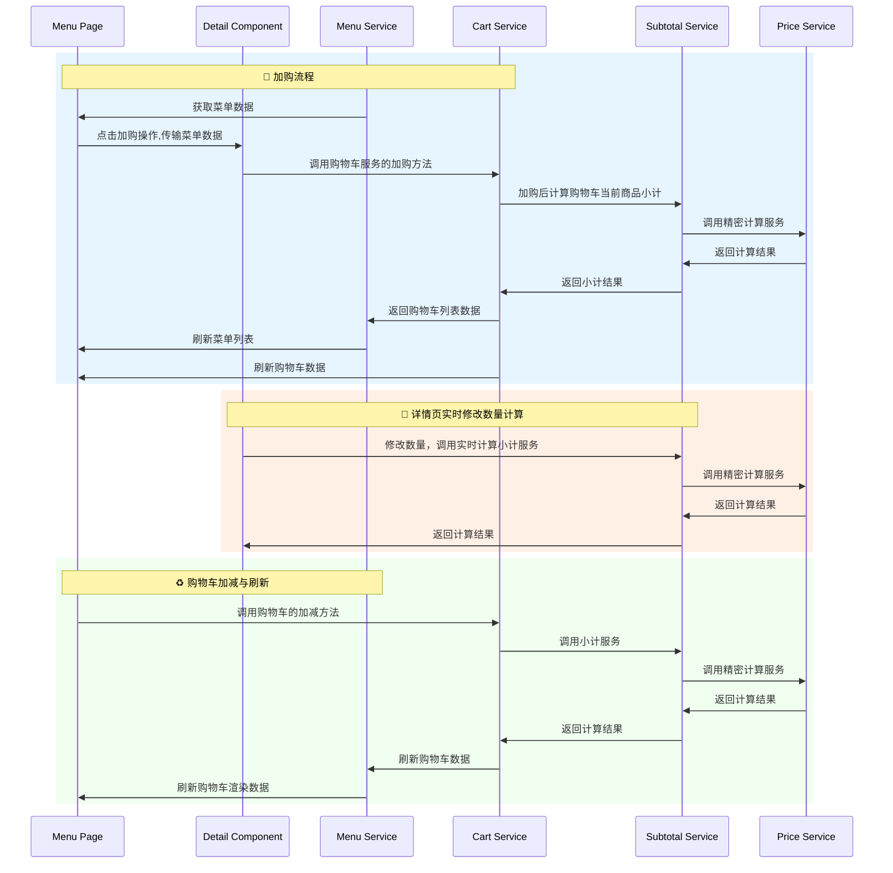

### 菜单加购逻辑

#### 操作逻辑
1. 菜单列表操作
   1. 点击加购打开详情页面
   2. 点击减号打开购物车列表页面
   3. 点击菜单列打开详情页面
2. 详情页操作
   1. 单品需选择规格和所有的加料（单选）
   2. 套餐需选择所有的轮次单品（单选）
   3. 数量操作
   4. 加入购物车操作
3. 购物车列表操作
   1. 点击底部总览打开购物车列表页面
   2. 点击内部加减可以添加减少当前已固定商品的数量
   3. 若减少到最后一个购物车服务会返回删除表示

#### 加购交互流程

